DNDFs paper
================
João Pedro S. Macalós
3/9/2021

Load required packages:

``` r
## Load packages
library(lubridate)
library(broom)
library(extrafont)
loadfonts(device = "win")
library(ggpubr)
library(ggridges)
library(zoo)
library(rugarch)
library(hashmap)
library(texreg)
library(tidyverse)
library(data.table)
```

Register “not in” and `multi_join` functions:

``` r
# Not in:
'%!in%' <- function(x,y)!('%in%'(x,y))

# Multi join:
multi_join = function(join_function, list_to_be_joined, ...) {
  Reduce(
    function(x, y, ...) join_function(x, y, all = TRUE, ...),
    list_to_be_joined
  )
}
```

# Load main datafiles

``` r
# Ptax, vix, and oil series:
ptax_vix_oil_vars = read_csv('Datasets/ptax_vix_oil.csv') %>%
  filter(date >= '2009-01-01') %>%
  set_names(c("date", "vix", "oil", "ptax"))
```

    ## 
    ## -- Column specification --------------------------------------------------------
    ## cols(
    ##   date = col_date(format = ""),
    ##   VIXCLS = col_double(),
    ##   DCOILWTICO = col_double(),
    ##   value = col_double()
    ## )

``` r
# Exchange rates of developing and emerging economies:
bis_fx_dees <- read_csv('Datasets/bis_fx_dees.csv')
```

    ## 
    ## -- Column specification --------------------------------------------------------
    ## cols(
    ##   date = col_date(format = ""),
    ##   fx_dees = col_double()
    ## )

``` r
# Same cleaned for ploting:
bis_fx_plot <- read_csv("Datasets/bis_fx_plot.csv")
```

    ## 
    ## -- Column specification --------------------------------------------------------
    ## cols(
    ##   date = col_date(format = ""),
    ##   name = col_character(),
    ##   value = col_double()
    ## )

``` r
# Information about DNDFs interventions from the BCB "open market" operations:
swaps_consolidated <- read_csv('Datasets/bcb_swaps.csv')
```

    ## 
    ## -- Column specification --------------------------------------------------------
    ## cols(
    ##   n = col_double(),
    ##   date = col_date(format = ""),
    ##   dt_auction = col_date(format = ""),
    ##   type = col_character(),
    ##   obs = col_character(),
    ##   dt_st = col_date(format = ""),
    ##   dt_mat = col_date(format = ""),
    ##   q_accepted = col_double(),
    ##   prazo = col_character(),
    ##   d_offer = col_double(),
    ##   min_rate = col_double(),
    ##   mean_rate = col_double(),
    ##   max_rate = col_double(),
    ##   sell = col_double(),
    ##   purchase = col_double()
    ## )

``` r
# Insitutional positions at the B3:

b3_fut <- read_csv('Datasets/b3_fut.csv')
```

    ## 
    ## -- Column specification --------------------------------------------------------
    ## cols(
    ##   date = col_date(format = ""),
    ##   sector = col_character(),
    ##   compra = col_double(),
    ##   compra_pc = col_double(),
    ##   venda = col_double(),
    ##   net = col_double(),
    ##   net_pc = col_double()
    ## )

``` r
b3_cupom <- read_csv('Datasets/b3_cupom.csv')
```

    ## 
    ## -- Column specification --------------------------------------------------------
    ## cols(
    ##   date = col_date(format = ""),
    ##   sector = col_character(),
    ##   compra = col_double(),
    ##   compra_pc = col_double(),
    ##   venda = col_double(),
    ##   venda_pc = col_double(),
    ##   net = col_double(),
    ##   net_pc = col_double()
    ## )

``` r
b3_swaps <- read_csv('Datasets/b3_swaps.csv')
```

    ## 
    ## -- Column specification --------------------------------------------------------
    ## cols(
    ##   date = col_date(format = ""),
    ##   sector = col_character(),
    ##   compra = col_double(),
    ##   compra_pc = col_double(),
    ##   venda = col_double(),
    ##   net = col_double(),
    ##   net_pc = col_double()
    ## )

``` r
b3_opc <- read_csv("Datasets/b3_opc.csv")
```

    ## 
    ## -- Column specification --------------------------------------------------------
    ## cols(
    ##   date = col_date(format = ""),
    ##   sector = col_character(),
    ##   compra = col_double(),
    ##   compra_pc = col_double(),
    ##   venda = col_double(),
    ##   net = col_double(),
    ##   net_pc = col_double()
    ## )

``` r
b3_opv <- read_csv("Datasets/b3_opv.csv")
```

    ## 
    ## -- Column specification --------------------------------------------------------
    ## cols(
    ##   date = col_date(format = ""),
    ##   sector = col_character(),
    ##   compra = col_double(),
    ##   compra_pc = col_double(),
    ##   venda = col_double(),
    ##   net = col_double(),
    ##   net_pc = col_double()
    ## )

``` r
# Banks spot USD position:
banks_spot_usd <- read_csv('Datasets/banks_spot_usd.csv')
```

    ## 
    ## -- Column specification --------------------------------------------------------
    ## cols(
    ##   date = col_date(format = ""),
    ##   value = col_double()
    ## )

``` r
# Financial volume at B3:
b3_volume <- read_csv("Datasets/b3_volume.csv")
```

    ## 
    ## -- Column specification --------------------------------------------------------
    ## cols(
    ##   date = col_date(format = ""),
    ##   mercado = col_character(),
    ##   vol_usd = col_double()
    ## )

``` r
# Libor and EMBI+:
libor <- read_csv("Datasets/libor_raw.csv", col_types = c("Dddddddddddd"))
embi <- read_csv("Datasets/embi_raw.csv")
```

    ## 
    ## -- Column specification --------------------------------------------------------
    ## cols(
    ##   code = col_character(),
    ##   date = col_date(format = ""),
    ##   value = col_double()
    ## )

# Figure 1: Institutional positions in the DNDFs market:

Function to widen b3 files:

``` r
wider_b3files <- function(dataset) {
  dataset %>%
    select(date, sector, net) %>%
    ungroup %>%
    mutate(net = net * 50000 / 10^9) %>% 
    filter(sector %!in% c('Pessoa Física', "DTVM'S e Corretoras de Valores", "Outras Jurídicas Financeiras")) %>%
    pivot_wider(id_cols = 'date', names_from = 'sector', values_from = 'net') %>%
    mutate(across(-c('date'), ~replace_na(.x, 0))) %>%
    filter(date >= '2008-12-01')
}
```

Reshape B3 files:

``` r
b_swaps <- b3_swaps %>%
  wider_b3files() %>%
  set_names(c('date', 'bcb', 'banks', 'institutional_investors', 'foreigners', 'non_financial_corps'))

b_cupom <- b3_cupom %>%
  wider_b3files() %>%
  set_names(c('date', 'banks', 'institutional_investors', 'foreigners', 'non_financial_corps'))

b_fut <- b3_fut  %>%
  wider_b3files() %>%
  set_names(c('date', 'banks', 'institutional_investors', 'foreigners', 'non_financial_corps'))

b_opc <- b3_opc %>%
  wider_b3files() %>%
  set_names(c('date', 'banks', 'institutional_investors', 'foreigners', 'non_financial_corps'))

b_opv <- b3_opv %>%
  wider_b3files() %>%
  set_names(c('date', 'banks', 'institutional_investors', 'foreigners', 'non_financial_corps')) %>%
  mutate(across(-date, ~ .x * -1))
```

Check that dates from b3 files are the same:

``` r
identical(b_cupom[,'date'], b_fut[,'date'])
```

    ## [1] TRUE

``` r
identical(b_cupom[,'date'], b_opc[,'date'])
```

    ## [1] TRUE

``` r
identical(b_cupom[,'date'], b_opv[,'date'])
```

    ## [1] TRUE

Combine FX derivatives markets:

``` r
b_futs <- b_cupom %>%
  bind_rows(b_fut) %>%
  bind_rows(b_opc) %>%
  bind_rows(b_opv) %>%
  group_by(date) %>%
  summarize(across(everything(), ~sum(.x))) %>%
  mutate(bcb = 0)
```

    ## `summarise()` ungrouping output (override with `.groups` argument)

Function to tidy and relevel sectors as factors for ploting:

``` r
tidy_b3files <- function(tibble) {
  tibble %>%
    pivot_longer(cols = -c('date'), names_to = 'sector', values_to = 'net') %>%
    mutate(sector = fct_relevel(sector, c(
      'bcb',
      'banks',
      'institutional_investors',
      'foreigners',
      'non_financial_corps'
    )))
}
```

Tidy files:

``` r
b_swaps_tidy <- b_swaps %>%
  tidy_b3files()

b_futs_tidy <- b_futs %>%
  tidy_b3files()
```

Labels for each group and dates:

``` r
# Group labels for plots
groups_labels <- c('Central Bank',
                   'Commercial Banks',
                   'Institutional Investors',
                   'Non Resident Investors',
                   'Non Financial Corps.')

# Plot A: positions at swaps market
dates <- select(b_swaps_tidy, date) %>% filter(date >= "2009-01-01") %>% unique() %>% pull()
```

## Figure 1

``` r
plot_inst1 <- b_swaps_tidy %>%
  filter(date >= '2009-01-01', date < "2021-01-01") %>%
  ggplot(aes(x = date, y = net, fill = sector)) +
  annotate("text", x = as.Date("2009-07-02"), y = 95, color = 'darkgray', label = "Long USD", size = 4) +
  annotate("text", x = as.Date("2009-07-02"), y = -95, color = 'darkgray', label = "Short USD", size = 4) +
  geom_col(width = 10) +
  bdscale::scale_x_bd(business.dates= dates, 
                      max.major.breaks = 30, 
                      max.minor.breaks = 10,
                      labels= scales::date_format("%Y")) +
  scale_fill_viridis_d('',
                       labels = groups_labels) +
  labs(x='', y='US$ Billion', subtitle = 'A: DNDFs market') +
  theme_bw(base_family = "MS Reference Sans Serif") +
  theme(legend.position = 'bottom',
        plot.caption = element_text(hjust = 0),
        axis.title.x = element_blank()) +
  guides(fill=guide_legend(nrow=2,byrow=TRUE))

  

#plot_inst1

# Plot B: positions at derivatives markets

plot_inst2 <- b_futs_tidy %>%
  filter(date >= '2009-01-01', date < "2021-01-01") %>%
  ggplot(aes(x = date, y = net, fill = sector)) +
  annotate("text", x = as.Date("2009-07-02"), y = 35, color = 'darkgray', label = "Long USD", size = 4) +
  annotate("text", x = as.Date("2009-07-02"), y = -35, color = 'darkgray', label = "Short USD", size = 4) +
  geom_col(width = 10) +
  bdscale::scale_x_bd(business.dates = dates, 
                      max.major.breaks=30, 
                      max.minor.breaks = 10,
                      labels= scales::date_format("%Y")) +
  scale_fill_viridis_d('',
                       labels = groups_labels) +
  theme_bw(base_family = "MS Reference Sans Serif") +
  labs(x='', y='US$ Billion', subtitle = 'B: DDI, FUT, and OPT markets') +
  theme(legend.position = 'bottom',
        plot.caption = element_text(hjust = 0),
        axis.title.x = element_blank()) +
  guides(fill=guide_legend(nrow=2,byrow=TRUE))


fig1 <- ggpubr::ggarrange(plot_inst1, plot_inst2, 
                  nrow = 2, ncol = 1,
                  common.legend = T,
                  legend = 'bottom') 

ggsave("Figures/fig1.png", plot = fig1, dpi = 500, height = 5.5, width = 6.5)

fig1
```

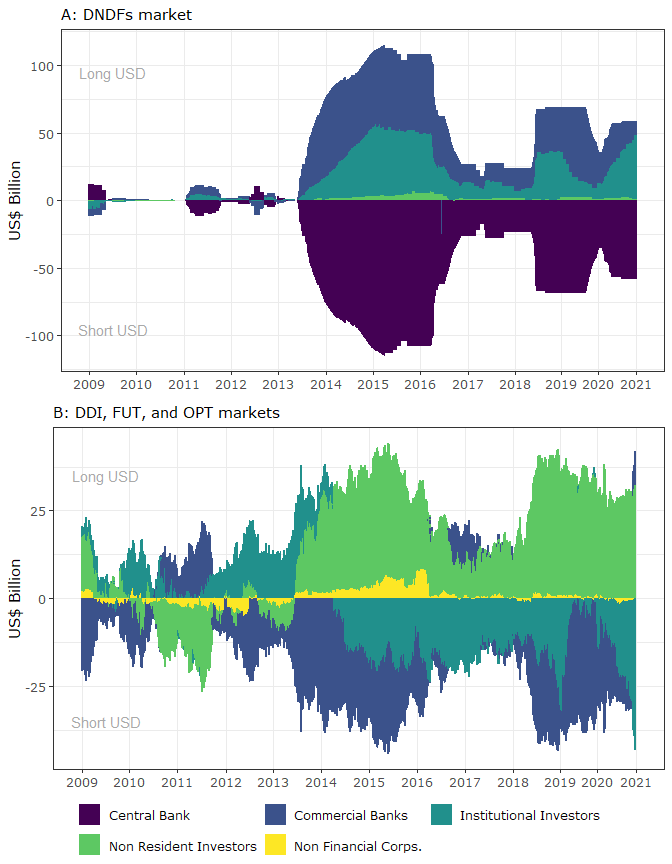<!-- -->

# Figure 2:

Clean dataset:

``` r
banks_spot_usd1 <- banks_spot_usd %>%
  as_tibble() %>%
  mutate(def = "Commercial banks' FX spot position") %>%
  filter(date >= '2009-01-01', date < "2021-01-01")
```

Plot:

``` r
banks_spot_plot = ggplot() + 
  geom_bar(data = banks_spot_usd1,
           aes(x=lag(date), y=value/1000, fill = def),
           stat='identity', width = 33) +
  annotate("text", x = as.Date("2009-07-02"), y = 10, color = 'darkgray', label = "Long USD", size = 4) +
  annotate("text", x = as.Date("2009-07-02"), y = -38, color = 'darkgray', label = "Short USD", size = 4) +
  scale_x_date(breaks = '1 year', date_labels = '%Y', minor_breaks = NULL) +
  #scale_fill_viridis_d('') +
  scale_fill_manual("", values = wesanderson::wes_palette("Zissou1")[2]) +
  labs(x='', y='US$ Billion') +
  theme_bw(base_family = "MS Reference Sans Serif") +
  theme(legend.position = 'none',
        plot.caption = element_text(hjust = 0)) +
  guides(fill=guide_legend(nrow=1,byrow=TRUE))

ggsave("Figures/fig2.png", plot = banks_spot_plot, dpi = 500, height = 5.5, width = 6.5)
```

    ## Warning: Removed 1 rows containing missing values (position_stack).

    ## Warning: position_stack requires non-overlapping x intervals

    ## Warning: position_stack requires non-overlapping x intervals

``` r
banks_spot_plot
```

    ## Warning: Removed 1 rows containing missing values (position_stack).

    ## Warning: position_stack requires non-overlapping x intervals

    ## Warning: position_stack requires non-overlapping x intervals

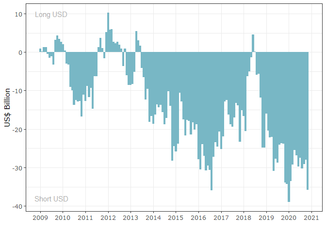<!-- -->

# Table 1

Function to summarize data to monthly frequency and get variations:

``` r
tidy_b3monthly <- function(tibble) {
  tibble %>%
    mutate(year = year(date), month = month(date)) %>%
    group_by(sector, year, month) %>%
    summarize(net = last(net)) %>%
    mutate(date = ymd(str_c(year, month, sep = '-'), truncated = 1)) %>%
    ungroup %>%
    select(date, sector, net) %>%
    group_by(sector) %>%
    mutate(net = net - lag(net)) %>%
    drop_na() %>%
    filter(date < "2021-01-01")
}
```

Reshape data for regressions:

``` r
b_swaps_monthly <- b_swaps_tidy %>%
  tidy_b3monthly() %>%
  pivot_wider(id_cols = 'date', names_from = 'sector', names_prefix = 'swaps_', values_from = 'net')
```

    ## `summarise()` regrouping output by 'sector', 'year' (override with `.groups` argument)

``` r
b_futs_monthly <- b_futs_tidy %>%
  tidy_b3monthly() %>%
  pivot_wider(id_cols = 'date', names_from = 'sector', names_prefix = 'futs_', values_from = 'net')
```

    ## `summarise()` regrouping output by 'sector', 'year' (override with `.groups` argument)

``` r
banks_spot <- banks_spot_usd %>%
  as_tibble() %>%
  mutate(spot_banks = (value - lag(value))/1000) %>%
  drop_na() %>%
  select(date, spot_banks) %>%
  filter(date < "2021-01-01")
```

``` r
b_reg_data <- left_join(b_swaps_monthly, b_futs_monthly) %>%
  left_join(banks_spot)
```

    ## Joining, by = "date"
    ## Joining, by = "date"

``` r
b_reg1 <- lm(futs_banks ~ swaps_bcb + futs_institutional_investors, data = b_reg_data)
b_rob1 <- lmtest::coeftest(b_reg1, vcov = sandwich::vcovHC(b_reg1, type = "HC0"))
#summary(b_reg1)

b_reg2 <- lm(futs_institutional_investors ~ swaps_bcb + futs_banks, data = b_reg_data)
b_rob2 <- lmtest::coeftest(b_reg2, vcov = sandwich::vcovHC(b_reg2, type = "HC0"))
#summary(b_reg2)

b_reg3 <- lm(spot_banks ~ swaps_bcb + futs_banks + futs_institutional_investors, data = b_reg_data)
b_rob3 <- lmtest::coeftest(b_reg3, vcov = sandwich::vcovHC(b_reg3, type = "HC0"))
#summary(b_reg3)

texreg::screenreg(list(b_reg1, b_rob1, b_reg2, b_rob2, b_reg3, b_rob3), stars = c(.01, .05, .1), digits = 3)
```

    ## 
    ## =======================================================================================================
    ##                               Model 1      Model 2     Model 3      Model 4     Model 5      Model 6   
    ## -------------------------------------------------------------------------------------------------------
    ## (Intercept)                     0.039       0.039       -0.163      -0.163       -0.160      -0.160    
    ##                                (0.394)     (0.384)      (0.290)     (0.288)      (0.349)     (0.346)   
    ## swaps_bcb                       0.168 **    0.168 ***    0.126 **    0.126 ***    0.121 **    0.121 *  
    ##                                (0.067)     (0.061)      (0.049)     (0.044)      (0.060)     (0.068)   
    ## futs_institutional_investors   -0.791 ***  -0.791 ***                            -0.152      -0.152    
    ##                                (0.093)     (0.096)                               (0.101)     (0.094)   
    ## futs_banks                                              -0.430 ***  -0.430 ***   -0.413 ***  -0.413 ***
    ##                                                         (0.050)     (0.064)      (0.075)     (0.084)   
    ## -------------------------------------------------------------------------------------------------------
    ## R^2                             0.348                    0.349                    0.206                
    ## Adj. R^2                        0.339                    0.340                    0.189                
    ## Num. obs.                     144                      144                      144                    
    ## =======================================================================================================
    ## *** p < 0.01; ** p < 0.05; * p < 0.1

# Figure 3

``` r
mav_b3_vol <- b3_volume %>%
  group_by(date) %>%
  summarize(vol_usd = sum(vol_usd, na.rm = TRUE)) %>%
  mutate(mav = as.numeric(data.table::frollmean(vol_usd, 6))) %>%
  drop_na()
```

    ## `summarise()` ungrouping output (override with `.groups` argument)

``` r
b3_vol2 <- b3_volume %>%
  pivot_wider(id_cols = date, names_from = mercado, values_from = vol_usd) %>%
  left_join(mav_b3_vol) %>%
  select(-vol_usd) %>%
  pivot_longer(cols = -date)
```

    ## Joining, by = "date"

``` r
fig3 <- ggplot(b3_vol2, aes(x = date)) +
  geom_col(data = filter(b3_vol2, name != "mav"), aes(fill = name, y = value), alpha = 0.4) +
  geom_col(data = filter(b3_vol2, name != "mav"), aes(fill = name, color = name, y = value), show.legend = FALSE, alpha = 0.4) +
  geom_line(data = filter(b3_vol2, name == "mav"), aes(y = value), color = "royalblue4", size = 2) +
  #annotate(geom = "text", x = as.Date("2012-08-01"), y = 375, label = "6 months moving average", color = "royalblue4", size = 5) +
  theme_bw() +
  #scale_fill_brewer("Contract:", palette = "YlGnBu", direction = -1) +
  #scale_fill_viridis_d("Contract:") +
  scale_fill_manual("Contract:", values = wesanderson::wes_palette("Zissou1")[c(1, 2, 3)]) +
  #scale_color_viridis_d() +
  scale_color_manual(values = wesanderson::wes_palette("Zissou1")[c(1, 2, 3)]) +
  labs(y = "US$ Billion", x = "") +
  scale_x_date(date_breaks = "2 year", date_labels = "%Y") +
  guides(fill = guide_legend(override.aes = list(alpha = 1) ) ) +
  theme(legend.position = c(.1, .85),
        legend.box.background = element_rect(colour = "black", size = 2),
        plot.caption = element_text(hjust = 0, face= "italic"))

ggsave("Figures/fig3.png", plot = fig3, dpi = 500, height = 5.5, width = 6.5)
```

    ## Warning: Removed 7 rows containing missing values (position_stack).

    ## Warning: Removed 7 rows containing missing values (position_stack).

    ## Warning: Removed 5 row(s) containing missing values (geom_path).

``` r
fig3
```

    ## Warning: Removed 7 rows containing missing values (position_stack).

    ## Warning: Removed 7 rows containing missing values (position_stack).

    ## Warning: Removed 5 row(s) containing missing values (geom_path).

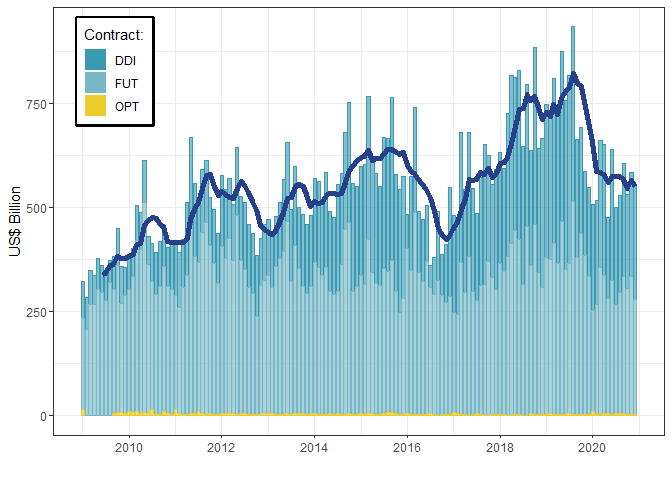<!-- -->

# Figure 4

Concatenate libor and embi files and rename:

``` r
control_libor_embi <- libor %>%
  janitor::clean_names() %>%
  left_join(rename(embi, embi = value)) %>%
  select(-code) %>%
  set_names(c("date", "m3", "m1", "m12", "m6", "on", "m2", "w1", "m9", "m4", 'w2', "m5", "embi")) %>%
  select(date, on, w1, m1, m2, m3, m6, m12, embi)
```

    ## Joining, by = "date"

Clean DNDFs tibble and remove purchase (reverse) swaps:

``` r
# Clean swaps tibble
swaps = swaps_consolidated %>% 
  distinct() %>% 
  mutate_at(vars(sell, purchase), list(~ as.numeric(.))) %>% 
  select(-obs) %>%
  filter(!is.na(q_accepted)) %>% 
  filter(q_accepted != 0)


# Remove purchase/reverse swaps
c_swaps = swaps %>% distinct() %>% filter(type == 'SWAPC')
```

Find maturities of each interventions to calculate the coupon-libor
spread:

``` r
d_swaps1 <- c_swaps %>%
  mutate(dt_to_mat = (dt_mat - dt_st)/30) %>%
  mutate(dt_to_mat = round(as.numeric(dt_to_mat))) %>%
  full_join(control_libor_embi, by= c('dt_auction' = "date")) %>%
  arrange(dt_auction) %>%
  mutate(spread = case_when(dt_to_mat == 0 ~ mean_rate - w1,
                            dt_to_mat == 1 ~ mean_rate - m1,
                            dt_to_mat == 2 ~ mean_rate - m2,
                            dt_to_mat == 3 ~ mean_rate - m3,
                            dt_to_mat == 4 ~ mean_rate - m3,
                            dt_to_mat == 5 ~ mean_rate - m3,
                            dt_to_mat == 6 ~ mean_rate - m6,
                            dt_to_mat == 7 ~ mean_rate - m6,
                            dt_to_mat == 8 ~ mean_rate - m6,
                            dt_to_mat == 9 ~ mean_rate - m6,
                            dt_to_mat == 10 ~ mean_rate - m6,
                            dt_to_mat == 11 ~ mean_rate - m6,
                            dt_to_mat >= 12 ~ mean_rate - m12
  )) %>%
  filter(embi != 0) %>%
  select(n, dt_auction, dt_st, dt_to_mat, q_accepted, spread, embi, mean_rate) %>%
  mutate_at(vars(-dt_auction, -n, -dt_st, -dt_to_mat), list(~replace_na(., 0))) %>%
  rename(date = dt_auction) %>%
  filter(date >= '2009-01-01', date < "2021-01-01")

 d_swaps2 <- d_swaps1 %>%
   filter(spread > 0) %>%
   mutate(spr_embi = spread - embi,
         above = if_else(spr_embi > 0, 1, 0))
```

Plot:

``` r
fig4 <- ggplot(data = d_swaps1, aes(x = date)) +
  geom_line(data = d_swaps1, aes(y = embi, color = 'black')) +
  geom_bar(data = (d_swaps2 %>% mutate(coupon = 1)), 
           aes(y = spread, fill = as_factor(coupon)), position = 'dodge', stat = 'identity', width = 5, alpha = 0.7) +
  scale_color_manual('', values='black', labels = c('EMBI+')) +
  scale_fill_manual('', labels=c('Coupon-libor spread'), values = "dodgerblue4") +
  labs(x='', y='(% p.a.)') +
  scale_x_date(breaks = '1 year', date_labels = '%Y') +
  #theme_minimal(base_family = 'MS Reference Sans Serif') +
  theme_bw(base_family = "MS Reference Sans Serif") +
  theme(legend.position = c(.8, .75),
    #legend.position = "bottom",
        legend.text.align = 0,
        legend.box.background = element_rect(color = 'black'),
        legend.background = element_blank(),
        plot.caption = element_text(hjust = 0),
        legend.direction="horizontal")

ggsave("Figures/fig4.png", plot = fig4, dpi = 500, height = 5.5, width = 6.5)
```

    ## Warning: position_dodge requires non-overlapping x intervals

``` r
fig4
```

    ## Warning: position_dodge requires non-overlapping x intervals

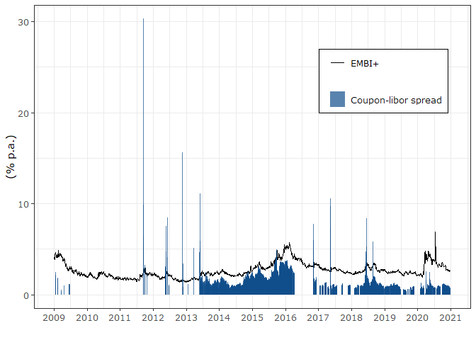<!-- -->

# Appendix A: GARCH analysis

Load functions to perform regressions:

``` r
source("garch_functions.R")
```

Consolidate DNDFs file by day:

``` r
p_swaps <- c_swaps %>% 
  group_by(n) %>%
  summarize(date = first(date), dt_auction = first(dt_auction), dt_st = first(dt_st),
            q_accepted = sum(q_accepted))
```

    ## `summarise()` ungrouping output (override with `.groups` argument)

``` r
p_swaps2 <- p_swaps %>%
  select(date = dt_auction, q_accepted) %>%
  group_by(date) %>% 
  summarize(q_accepted = sum(q_accepted))
```

    ## `summarise()` ungrouping output (override with `.groups` argument)

Create tibble for analysis:

``` r
# 1. Load dependent and control variables, drop nas, convert into a tibble, and exclude day with negative oil prices:
garch_vars <- ptax_vix_oil_vars %>%
  drop_na(ptax, vix, oil) %>%
  filter(oil > 0)

garch_datap <- garch_vars %>%
  full_join(p_swaps2) %>%
  arrange(date) %>%
  filter(date >= '2009-01-01', date < "2021-01-01") %>%
  mutate(q_accepted = replace_na(q_accepted, 0)) %>%
  select(date, q_accepted, everything()) %>%
  mutate(across(c(vix, oil, ptax), ~ log(.x))) %>% 
  mutate(across(c(vix, oil, ptax), ~ .x - lag(.x))) %>%
  drop_na()
```

    ## Joining, by = "date"

## GARCH adequacy tests:

Plot returns with squared and absolute returns

``` r
adeq_1 = garch_datap %>% 
  select(date, ptax) %>%
  mutate(sq = ptax^2, abs = abs(ptax)) %>% 
  mutate_at(vars(ptax), list(~ zoo(.,date))) %>%
  drop_na()
adeq_2 = cbind(adeq_1$ptax, adeq_1$sq, adeq_1$abs)
colnames(adeq_2) = c('ptax', 'ptax_sq', 'ptax_abs')
plot.zoo(adeq_2, main='', col='blue', xlab='')  
```

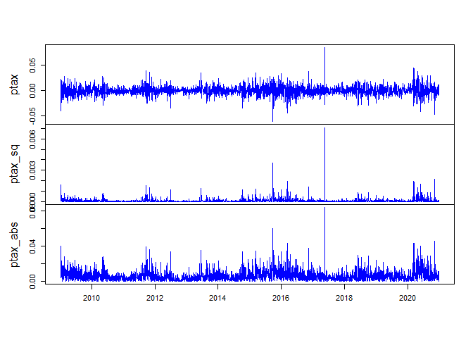<!-- -->

Note the spikes in the returns that justify the utilization of GARCH
models.

Plot autocorrelations of returns, returns^2 and abs(returns)

``` r
par(mfrow=c(3,1))
acf(adeq_2$ptax, main="ER Returns", na.action = na.pass)
acf(adeq_2$ptax_sq, main="ER Returns^2", na.action = na.pass)
acf(adeq_2$ptax_abs, main="ER abs(Returns)", na.action = na.pass)
```

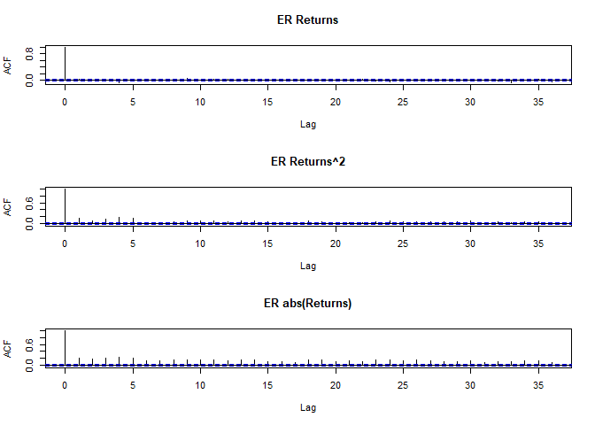<!-- -->

``` r
par(mfrow=c(1,1)) 
```

``` r
# compute summary statistics
PerformanceAnalytics::table.Stats(adeq_2)
```

    ##                      ptax   ptax_sq  ptax_abs
    ## Observations    2896.0000 2896.0000 2896.0000
    ## NAs                0.0000    0.0000    0.0000
    ## Minimum           -0.0607    0.0000    0.0000
    ## Quartile 1        -0.0047    0.0000    0.0021
    ## Median             0.0001    0.0000    0.0048
    ## Arithmetic Mean    0.0002    0.0001    0.0066
    ## Geometric Mean     0.0002    0.0001    0.0065
    ## Quartile 3         0.0049    0.0001    0.0090
    ## Maximum            0.0842    0.0071    0.0842
    ## SE Mean            0.0002    0.0000    0.0001
    ## LCL Mean (0.95)   -0.0001    0.0001    0.0063
    ## UCL Mean (0.95)    0.0005    0.0001    0.0068
    ## Variance           0.0001    0.0000    0.0000
    ## Stdev              0.0091    0.0002    0.0064
    ## Skewness           0.2151   14.5064    2.5110
    ## Kurtosis           5.0735  374.6307   13.4063

``` r
which.min(adeq_2$ptax)
```

    ## [1] 1638

``` r
adeq_2$ptax[1638] # Turbulência de setembro/2015
```

    ##  2015-09-25 
    ## -0.06068571

``` r
which.max(adeq_2$ptax)
```

    ## [1] 2034

``` r
adeq_2$ptax[2034] # 18 de maio de 2017 (JBS scandal)
```

    ## 2017-05-18 
    ## 0.08423206

Testing for ARCH/GARCH effects in returns

``` r
# use Box.test from stats package
Box.test(coredata(adeq_2$ptax_sq), type="Ljung-Box", lag = 12)
```

    ## 
    ##  Box-Ljung test
    ## 
    ## data:  coredata(adeq_2$ptax_sq)
    ## X-squared = 258.47, df = 12, p-value < 2.2e-16

Enough evidence to reject the null effect of no auto-correlation in the
residuals

``` r
# use ArchTest() function from FinTS package for Engle's LM test
FinTS::ArchTest(adeq_2$ptax)
```

    ## 
    ##  ARCH LM-test; Null hypothesis: no ARCH effects
    ## 
    ## data:  adeq_2$ptax
    ## Chi-squared = 145.05, df = 12, p-value < 2.2e-16

Evidence of ARCH effets.

## Estimations

Identify ays with spread above EMBI:

``` r
days_spread <- d_swaps2 %>%
  filter(above == 1) %>%
  select(date, spr = above) %>%
  distinct()
```

Join `days_spread` and `bis_fx_dees` and normalize by standard
deviations:

``` r
garch_spr <- garch_datap %>%
  left_join(days_spread) %>%
  mutate(spr = replace_na(spr, 0),
         swap = if_else(q_accepted > 0, 1, 0)) %>%
  drop_na() %>%
  left_join(bis_fx_dees) %>%
  drop_na() %>%
  mutate(across(c(vix, oil, ptax, fx_dees), ~ .x / sd(.x))) %>%
  mutate(across(contains(c('spr', 'swap')), list(lag = ~ lag(.x),
                                         lead = ~ lead(.x)))) %>%
  drop_na() %>%
  select(date, vix, oil, ptax, fx_dees, spr_lag, spr_lead, swap_lag, swap_lead)
```

    ## Joining, by = "date"
    ## Joining, by = "date"

Create `zoo` objects (necessary for estimating garch models with
`rugarch`):

``` r
spr_control <- garch_spr %>% 
  select(-ptax, -swap_lag, -swap_lead) %>%
  zoo::read.zoo()

swap_control <- garch_spr %>%
  select(-ptax, -spr_lag, -spr_lead) %>%
  zoo::read.zoo()
```

Transform into matrices:

``` r
spr_matrix <- as.matrix(spr_control)
swap_matrix <- as.matrix(swap_control)
```

Create `zoo` file for dependent variable:

``` r
spr_ptax <- garch_spr %>% select(date, ptax) %>% zoo::read.zoo()
```

### Estimate GARCH models

``` r
# Only spreads above EMBI
spr_garch_est <- estimate_garch(ext_regressors = spr_matrix, dep_var = spr_ptax)
```

    ## 
    ## Iter: 1 fn: 3209.9147     Pars:   0.01518  0.10293 -0.15241  0.39786 -0.74776  1.09927  0.01297  0.09019  0.89676
    ## Iter: 2 fn: 3209.9147     Pars:   0.01518  0.10292 -0.15241  0.39787 -0.74770  1.09901  0.01297  0.09017  0.89678
    ## solnp--> Completed in 2 iterations
    ## 
    ## Iter: 1 fn: 3185.9242     Pars:   0.0329044  0.0878575 -0.1526893  0.3911746 -0.6311115  0.6385680 -0.0004927  0.0451247  0.9865947  0.1288858
    ## Iter: 2 fn: 3185.9242     Pars:   0.0329059  0.0878636 -0.1526873  0.3911683 -0.6311228  0.6386204 -0.0004928  0.0451262  0.9865949  0.1288854
    ## solnp--> Completed in 2 iterations
    ## 
    ## Iter: 1 fn: 3202.0531     Pars:   0.025841  0.084802 -0.149972  0.405091 -0.637562  0.498430  0.008858  0.095859  0.924747 -0.058802
    ## Iter: 2 fn: 3202.0531     Pars:   0.025839  0.084804 -0.149969  0.405091 -0.637572  0.498477  0.008858  0.095860  0.924746 -0.058801
    ## solnp--> Completed in 2 iterations
    ## 
    ## Iter: 1 fn: 3084.3629     Pars:   0.01133  0.07239 -0.13755  0.39203 -0.53282  0.50947  0.01022  0.07923  0.90767  6.72206
    ## Iter: 2 fn: 3084.3629     Pars:   0.01133  0.07239 -0.13754  0.39203 -0.53286  0.50948  0.01022  0.07922  0.90767  6.72259
    ## solnp--> Completed in 2 iterations
    ## 
    ## Iter: 1 fn: 3072.6112     Pars:   0.017815  0.068349 -0.140620  0.391149 -0.535610  0.507643 -0.007052  0.048454  0.989339  0.124767  7.071408
    ## Iter: 2 fn: 3072.6112     Pars:   0.017813  0.068351 -0.140617  0.391146 -0.535606  0.507644 -0.007053  0.048454  0.989339  0.124769  7.071438
    ## solnp--> Completed in 2 iterations
    ## 
    ## Iter: 1 fn: 3079.9551     Pars:   0.016463  0.071826 -0.137826  0.391524 -0.532590  0.489374  0.008995  0.103159  0.911834 -0.052266  6.921003
    ## Iter: 2 fn: 3079.9551     Pars:   0.016464  0.071826 -0.137826  0.391524 -0.532603  0.489363  0.008995  0.103159  0.911834 -0.052266  6.921086
    ## solnp--> Completed in 2 iterations
    ## 
    ## Iter: 1 fn: 3083.4610     Pars:   0.016257  0.072805 -0.138522  0.389674 -0.538861  0.508536  0.009926  0.079035  0.908349  1.038428  6.733223
    ## Iter: 2 fn: 3083.4610     Pars:   0.016256  0.072806 -0.138521  0.389674 -0.538859  0.508555  0.009926  0.079035  0.908349  1.038426  6.733300
    ## solnp--> Completed in 2 iterations
    ## 
    ## Iter: 1 fn: 3071.0974     Pars:   0.024112  0.069460 -0.142345  0.388783 -0.541650  0.507355 -0.006506  0.049733  0.989493  0.124110  1.050321  7.084196
    ## Iter: 2 fn: 3071.0974     Pars:   0.024108  0.069464 -0.142352  0.388793 -0.541627  0.507344 -0.006506  0.049733  0.989492  0.124106  1.050317  7.084301
    ## solnp--> Completed in 2 iterations
    ## 
    ## Iter: 1 fn: 3078.8323     Pars:   0.021882  0.072264 -0.138923  0.389108 -0.538009  0.489030  0.008774  0.103920  0.912415 -0.053520  1.042905  6.930278
    ## Iter: 2 fn: 3078.8323     Pars:   0.021883  0.072263 -0.138923  0.389111 -0.537979  0.488979  0.008775  0.103918  0.912414 -0.053515  1.042902  6.930127
    ## solnp--> Completed in 2 iterations

``` r
# All swaps (robustness check)
swap_garch_est <- estimate_garch(ext_regressors = swap_matrix, dep_var = spr_ptax)
```

    ## 
    ## Iter: 1 fn: 3214.8745     Pars:   0.019525  0.071731 -0.156692  0.405514 -0.158670  0.140544  0.009962  0.076415  0.913696
    ## Iter: 2 fn: 3214.8745     Pars:   0.019523  0.071729 -0.156693  0.405510 -0.158671  0.140550  0.009961  0.076416  0.913696
    ## solnp--> Completed in 2 iterations
    ## 
    ## Iter: 1 fn: 3185.7309     Pars:   0.035824  0.059394 -0.164203  0.401210 -0.150595  0.121334 -0.001355  0.051812  0.986427  0.132049
    ## Iter: 2 fn: 3185.7309     Pars:   0.035823  0.059393 -0.164203  0.401210 -0.150594  0.121334 -0.001356  0.051812  0.986427  0.132049
    ## solnp--> Completed in 2 iterations
    ## 
    ## Iter: 1 fn: 3203.9726     Pars:   0.03514  0.06932 -0.15335  0.40684 -0.15839  0.12192  0.00829  0.10054  0.92395 -0.06477
    ## Iter: 2 fn: 3203.9726     Pars:   0.035132  0.069325 -0.153345  0.406846 -0.158401  0.121922  0.008289  0.100544  0.923948 -0.064766
    ## solnp--> Completed in 2 iterations
    ## 
    ## Iter: 1 fn: 3092.6261     Pars:   0.002964  0.072869 -0.137437  0.390568 -0.020137  0.045382  0.011017  0.084245  0.901992  6.742646
    ## Iter: 2 fn: 3092.6261     Pars:   0.002966  0.072868 -0.137437  0.390569 -0.020142  0.045386  0.011015  0.084234  0.902006  6.742486
    ## solnp--> Completed in 2 iterations
    ## 
    ## Iter: 1 fn: 3080.9932     Pars:   0.016962  0.067258 -0.141462  0.391322 -0.025044  0.028070 -0.007709  0.051514  0.988050  0.132780  7.124622
    ## Iter: 2 fn: 3080.9932     Pars:   0.016959  0.067259 -0.141459  0.391316 -0.025038  0.028068 -0.007709  0.051513  0.988050  0.132778  7.124640
    ## solnp--> Completed in 2 iterations
    ## 
    ## Iter: 1 fn: 3087.9639     Pars:   0.012132  0.071937 -0.138003  0.390527 -0.024648  0.037552  0.009529  0.108928  0.907593 -0.055914  6.955785
    ## Iter: 2 fn: 3087.9639     Pars:   0.012137  0.071936 -0.138003  0.390527 -0.024647  0.037544  0.009529  0.108925  0.907596 -0.055917  6.956126
    ## solnp--> Completed in 2 iterations
    ## 
    ## Iter: 1 fn: 3091.6972     Pars:   0.008386  0.073132 -0.138483  0.388135 -0.021831  0.045552  0.010614  0.083808  0.903092  1.039036  6.747534
    ## Iter: 2 fn: 3091.6972     Pars:   0.008386  0.073134 -0.138484  0.388135 -0.021836  0.045556  0.010613  0.083801  0.903099  1.039034  6.747994
    ## solnp--> Completed in 2 iterations
    ## 
    ## Iter: 1 fn: 3079.2969     Pars:   0.023482  0.068329 -0.142800  0.388340 -0.028862  0.032787 -0.006978  0.052900  0.988387  0.131446  1.053170  7.131203
    ## Iter: 2 fn: 3079.2969     Pars:   0.023481  0.068327 -0.142802  0.388338 -0.028862  0.032791 -0.006977  0.052899  0.988387  0.131445  1.053172  7.131310
    ## solnp--> Completed in 2 iterations
    ## 
    ## Iter: 1 fn: 3086.7624     Pars:   0.01812  0.07222 -0.13919  0.38802 -0.02631  0.03785  0.00923  0.10948  0.90858 -0.05728  1.04436  6.96282
    ## Iter: 2 fn: 3086.7624     Pars:   0.01812  0.07222 -0.13920  0.38802 -0.02631  0.03785  0.00923  0.10949  0.90858 -0.05729  1.04436  6.96249
    ## solnp--> Completed in 2 iterations

### Goodness-of-fit statistics

``` r
# Save standardized residuals
spr_std_residuals <- map(spr_garch_est, ~residuals(.x, standardize = T))

## Standardized residuals 
map(spr_std_residuals, ~as_tibble(rugarch_boxtest(.x, df = 1), rownames = 'Lag'))
```

    ## $sGARCHnorm
    ## # A tibble: 3 x 3
    ##   Lag                     statistic `p-value`
    ##   <chr>                       <dbl>     <dbl>
    ## 1 Lag[1]                      0.595     0.440
    ## 2 Lag[2*(p+q)+(p+q)-1][2]     1.12      0.664
    ## 3 Lag[4*(p+q)+(p+q)-1][5]     2.17      0.661
    ## 
    ## $eGARCHnorm
    ## # A tibble: 3 x 3
    ##   Lag                     statistic `p-value`
    ##   <chr>                       <dbl>     <dbl>
    ## 1 Lag[1]                      0.369     0.544
    ## 2 Lag[2*(p+q)+(p+q)-1][2]     0.822     0.840
    ## 3 Lag[4*(p+q)+(p+q)-1][5]     1.79      0.771
    ## 
    ## $gjrGARCHnorm
    ## # A tibble: 3 x 3
    ##   Lag                     statistic `p-value`
    ##   <chr>                       <dbl>     <dbl>
    ## 1 Lag[1]                      0.243     0.622
    ## 2 Lag[2*(p+q)+(p+q)-1][2]     0.714     0.892
    ## 3 Lag[4*(p+q)+(p+q)-1][5]     1.62      0.817
    ## 
    ## $sGARCHstd
    ## # A tibble: 3 x 3
    ##   Lag                     statistic `p-value`
    ##   <chr>                       <dbl>     <dbl>
    ## 1 Lag[1]                     0.0378     0.846
    ## 2 Lag[2*(p+q)+(p+q)-1][2]    0.366      0.988
    ## 3 Lag[4*(p+q)+(p+q)-1][5]    1.15       0.922
    ## 
    ## $eGARCHstd
    ## # A tibble: 3 x 3
    ##   Lag                     statistic `p-value`
    ##   <chr>                       <dbl>     <dbl>
    ## 1 Lag[1]                      0.227     0.634
    ## 2 Lag[2*(p+q)+(p+q)-1][2]     0.616     0.930
    ## 3 Lag[4*(p+q)+(p+q)-1][5]     1.53      0.838
    ## 
    ## $gjrGARCHstd
    ## # A tibble: 3 x 3
    ##   Lag                     statistic `p-value`
    ##   <chr>                       <dbl>     <dbl>
    ## 1 Lag[1]                     0.0594     0.807
    ## 2 Lag[2*(p+q)+(p+q)-1][2]    0.421      0.980
    ## 3 Lag[4*(p+q)+(p+q)-1][5]    1.25       0.903
    ## 
    ## $sGARCHsstd
    ## # A tibble: 3 x 3
    ##   Lag                     statistic `p-value`
    ##   <chr>                       <dbl>     <dbl>
    ## 1 Lag[1]                     0.0316     0.859
    ## 2 Lag[2*(p+q)+(p+q)-1][2]    0.365      0.988
    ## 3 Lag[4*(p+q)+(p+q)-1][5]    1.16       0.921
    ## 
    ## $eGARCHsstd
    ## # A tibble: 3 x 3
    ##   Lag                     statistic `p-value`
    ##   <chr>                       <dbl>     <dbl>
    ## 1 Lag[1]                      0.215     0.643
    ## 2 Lag[2*(p+q)+(p+q)-1][2]     0.609     0.933
    ## 3 Lag[4*(p+q)+(p+q)-1][5]     1.53      0.838
    ## 
    ## $gjrGARCHsstd
    ## # A tibble: 3 x 3
    ##   Lag                     statistic `p-value`
    ##   <chr>                       <dbl>     <dbl>
    ## 1 Lag[1]                     0.0503     0.822
    ## 2 Lag[2*(p+q)+(p+q)-1][2]    0.413      0.981
    ## 3 Lag[4*(p+q)+(p+q)-1][5]    1.24       0.904

``` r
#--> No evidence of remaining autocorrelation
```

``` r
## Standardized squared residuals
map(spr_std_residuals, ~as_tibble(rugarch_boxtest(.x, df = 2, p = 2), rownames = 'Lag'))
```

    ## $sGARCHnorm
    ## # A tibble: 3 x 3
    ##   Lag                     statistic `p-value`
    ##   <chr>                       <dbl>     <dbl>
    ## 1 Lag[1]                     0.0474     0.828
    ## 2 Lag[2*(p+q)+(p+q)-1][5]    0.224      0.991
    ## 3 Lag[4*(p+q)+(p+q)-1][9]    0.526      0.998
    ## 
    ## $eGARCHnorm
    ## # A tibble: 3 x 3
    ##   Lag                     statistic `p-value`
    ##   <chr>                       <dbl>     <dbl>
    ## 1 Lag[1]                      0.209     0.647
    ## 2 Lag[2*(p+q)+(p+q)-1][5]     0.236     0.990
    ## 3 Lag[4*(p+q)+(p+q)-1][9]     0.382     0.999
    ## 
    ## $gjrGARCHnorm
    ## # A tibble: 3 x 3
    ##   Lag                     statistic `p-value`
    ##   <chr>                       <dbl>     <dbl>
    ## 1 Lag[1]                    0.00273     0.958
    ## 2 Lag[2*(p+q)+(p+q)-1][5]   0.0765      0.999
    ## 3 Lag[4*(p+q)+(p+q)-1][9]   0.258       1.00 
    ## 
    ## $sGARCHstd
    ## # A tibble: 3 x 3
    ##   Lag                     statistic `p-value`
    ##   <chr>                       <dbl>     <dbl>
    ## 1 Lag[1]                    0.00453     0.946
    ## 2 Lag[2*(p+q)+(p+q)-1][5]   0.117       0.997
    ## 3 Lag[4*(p+q)+(p+q)-1][9]   0.340       1.00 
    ## 
    ## $eGARCHstd
    ## # A tibble: 3 x 3
    ##   Lag                     statistic `p-value`
    ##   <chr>                       <dbl>     <dbl>
    ## 1 Lag[1]                      0.253     0.615
    ## 2 Lag[2*(p+q)+(p+q)-1][5]     0.296     0.984
    ## 3 Lag[4*(p+q)+(p+q)-1][9]     0.472     0.999
    ## 
    ## $gjrGARCHstd
    ## # A tibble: 3 x 3
    ##   Lag                     statistic `p-value`
    ##   <chr>                       <dbl>     <dbl>
    ## 1 Lag[1]                     0.0102     0.920
    ## 2 Lag[2*(p+q)+(p+q)-1][5]    0.158      0.995
    ## 3 Lag[4*(p+q)+(p+q)-1][9]    0.411      0.999
    ## 
    ## $sGARCHsstd
    ## # A tibble: 3 x 3
    ##   Lag                     statistic `p-value`
    ##   <chr>                       <dbl>     <dbl>
    ## 1 Lag[1]                    0.00431     0.948
    ## 2 Lag[2*(p+q)+(p+q)-1][5]   0.114       0.998
    ## 3 Lag[4*(p+q)+(p+q)-1][9]   0.336       1.00 
    ## 
    ## $eGARCHsstd
    ## # A tibble: 3 x 3
    ##   Lag                     statistic `p-value`
    ##   <chr>                       <dbl>     <dbl>
    ## 1 Lag[1]                      0.259     0.611
    ## 2 Lag[2*(p+q)+(p+q)-1][5]     0.299     0.984
    ## 3 Lag[4*(p+q)+(p+q)-1][9]     0.469     0.999
    ## 
    ## $gjrGARCHsstd
    ## # A tibble: 3 x 3
    ##   Lag                     statistic `p-value`
    ##   <chr>                       <dbl>     <dbl>
    ## 1 Lag[1]                     0.0102     0.919
    ## 2 Lag[2*(p+q)+(p+q)-1][5]    0.156      0.995
    ## 3 Lag[4*(p+q)+(p+q)-1][9]    0.408      0.999

``` r
#--> No evidence of remaining GARCH effects
```

``` r
## Weighted ARCH-LM test
map(spr_garch_est, ~as_tibble(rugarch_archlm(.x), rownames = 'Lag'))
```

    ## $sGARCHnorm
    ## # A tibble: 3 x 5
    ##   Lag         Statistic Shape Scale `P-Value`
    ##   <chr>           <dbl> <dbl> <dbl>     <dbl>
    ## 1 ARCH Lag[3]    0.0618  0.5   2        0.804
    ## 2 ARCH Lag[5]    0.188   1.44  1.67     0.968
    ## 3 ARCH Lag[7]    0.426   2.31  1.54     0.985
    ## 
    ## $eGARCHnorm
    ## # A tibble: 3 x 5
    ##   Lag         Statistic Shape Scale `P-Value`
    ##   <chr>           <dbl> <dbl> <dbl>     <dbl>
    ## 1 ARCH Lag[3]  0.000901  0.5   2        0.976
    ## 2 ARCH Lag[5]  0.0650    1.44  1.67     0.993
    ## 3 ARCH Lag[7]  0.201     2.31  1.54     0.997
    ## 
    ## $gjrGARCHnorm
    ## # A tibble: 3 x 5
    ##   Lag         Statistic Shape Scale `P-Value`
    ##   <chr>           <dbl> <dbl> <dbl>     <dbl>
    ## 1 ARCH Lag[3]    0.0181  0.5   2        0.893
    ## 2 ARCH Lag[5]    0.0723  1.44  1.67     0.992
    ## 3 ARCH Lag[7]    0.245   2.31  1.54     0.995
    ## 
    ## $sGARCHstd
    ## # A tibble: 3 x 5
    ##   Lag         Statistic Shape Scale `P-Value`
    ##   <chr>           <dbl> <dbl> <dbl>     <dbl>
    ## 1 ARCH Lag[3]    0.0393  0.5   2        0.843
    ## 2 ARCH Lag[5]    0.125   1.44  1.67     0.982
    ## 3 ARCH Lag[7]    0.303   2.31  1.54     0.993
    ## 
    ## $eGARCHstd
    ## # A tibble: 3 x 5
    ##   Lag         Statistic Shape Scale `P-Value`
    ##   <chr>           <dbl> <dbl> <dbl>     <dbl>
    ## 1 ARCH Lag[3]   0.00923  0.5   2        0.923
    ## 2 ARCH Lag[5]   0.110    1.44  1.67     0.985
    ## 3 ARCH Lag[7]   0.264    2.31  1.54     0.995
    ## 
    ## $gjrGARCHstd
    ## # A tibble: 3 x 5
    ##   Lag         Statistic Shape Scale `P-Value`
    ##   <chr>           <dbl> <dbl> <dbl>     <dbl>
    ## 1 ARCH Lag[3]    0.0544  0.5   2        0.816
    ## 2 ARCH Lag[5]    0.160   1.44  1.67     0.975
    ## 3 ARCH Lag[7]    0.374   2.31  1.54     0.988
    ## 
    ## $sGARCHsstd
    ## # A tibble: 3 x 5
    ##   Lag         Statistic Shape Scale `P-Value`
    ##   <chr>           <dbl> <dbl> <dbl>     <dbl>
    ## 1 ARCH Lag[3]    0.0383  0.5   2        0.845
    ## 2 ARCH Lag[5]    0.121   1.44  1.67     0.983
    ## 3 ARCH Lag[7]    0.298   2.31  1.54     0.993
    ## 
    ## $eGARCHsstd
    ## # A tibble: 3 x 5
    ##   Lag         Statistic Shape Scale `P-Value`
    ##   <chr>           <dbl> <dbl> <dbl>     <dbl>
    ## 1 ARCH Lag[3]   0.00864  0.5   2        0.926
    ## 2 ARCH Lag[5]   0.103    1.44  1.67     0.986
    ## 3 ARCH Lag[7]   0.253    2.31  1.54     0.995
    ## 
    ## $gjrGARCHsstd
    ## # A tibble: 3 x 5
    ##   Lag         Statistic Shape Scale `P-Value`
    ##   <chr>           <dbl> <dbl> <dbl>     <dbl>
    ## 1 ARCH Lag[3]    0.0541  0.5   2        0.816
    ## 2 ARCH Lag[5]    0.157   1.44  1.67     0.975
    ## 3 ARCH Lag[7]    0.369   2.31  1.54     0.989

``` r
#--> No evidence of remaining GARCH effects
```

``` r
## Individual Nyblom stability tests
# Create a dictionary to correct column names
ext_regs_name <- colnames(spr_matrix)
ext_mxreg <- str_c('mxreg', 1:5)

dict_ext_reg <- tibble(key = ext_mxreg, value = ext_regs_name)
dict_ext <- {hashmap::hashmap(dict_ext_reg$key, dict_ext_reg$value)}

map(spr_garch_est, ~as_tibble(nyblom(.x)$IndividualStat, rownames = 'Variable') %>%
      mutate(Variable = case_when(Variable %in% ext_mxreg ~ dict_ext[[Variable]],
                                  T ~ Variable)) %>%
      mutate(Stable_5pc = if_else(V1 - 0.47 > 0, 'No', 'Yes')))
```

    ## Warning: The `x` argument of `as_tibble.matrix()` must have unique column names if `.name_repair` is omitted as of tibble 2.0.0.
    ## Using compatibility `.name_repair`.
    ## This warning is displayed once every 8 hours.
    ## Call `lifecycle::last_warnings()` to see where this warning was generated.

    ## $sGARCHnorm
    ## # A tibble: 9 x 3
    ##   Variable     V1 Stable_5pc
    ##   <chr>     <dbl> <chr>     
    ## 1 mu       0.190  Yes       
    ## 2 vix      0.0594 Yes       
    ## 3 oil      0.882  No        
    ## 4 fx_dees  0.563  No        
    ## 5 spr_lag  0.0844 Yes       
    ## 6 spr_lead 0.149  Yes       
    ## 7 omega    0.471  No        
    ## 8 alpha1   0.377  Yes       
    ## 9 beta1    0.385  Yes       
    ## 
    ## $eGARCHnorm
    ## # A tibble: 10 x 3
    ##    Variable     V1 Stable_5pc
    ##    <chr>     <dbl> <chr>     
    ##  1 mu       0.0431 Yes       
    ##  2 vix      0.190  Yes       
    ##  3 oil      0.732  No        
    ##  4 fx_dees  0.499  No        
    ##  5 spr_lag  0.0785 Yes       
    ##  6 spr_lead 0.0851 Yes       
    ##  7 omega    0.337  Yes       
    ##  8 alpha1   0.185  Yes       
    ##  9 beta1    0.289  Yes       
    ## 10 gamma1   0.118  Yes       
    ## 
    ## $gjrGARCHnorm
    ## # A tibble: 10 x 3
    ##    Variable     V1 Stable_5pc
    ##    <chr>     <dbl> <chr>     
    ##  1 mu       0.0521 Yes       
    ##  2 vix      0.185  Yes       
    ##  3 oil      1.18   No        
    ##  4 fx_dees  0.552  No        
    ##  5 spr_lag  0.0833 Yes       
    ##  6 spr_lead 0.0236 Yes       
    ##  7 omega    0.337  Yes       
    ##  8 alpha1   0.328  Yes       
    ##  9 beta1    0.253  Yes       
    ## 10 gamma1   0.348  Yes       
    ## 
    ## $sGARCHstd
    ## # A tibble: 10 x 3
    ##    Variable     V1 Stable_5pc
    ##    <chr>     <dbl> <chr>     
    ##  1 mu       0.243  Yes       
    ##  2 vix      0.414  Yes       
    ##  3 oil      1.67   No        
    ##  4 fx_dees  0.566  No        
    ##  5 spr_lag  0.0798 Yes       
    ##  6 spr_lead 0.0803 Yes       
    ##  7 omega    0.321  Yes       
    ##  8 alpha1   0.270  Yes       
    ##  9 beta1    0.303  Yes       
    ## 10 shape    0.103  Yes       
    ## 
    ## $eGARCHstd
    ## # A tibble: 11 x 3
    ##    Variable     V1 Stable_5pc
    ##    <chr>     <dbl> <chr>     
    ##  1 mu       0.143  Yes       
    ##  2 vix      0.356  Yes       
    ##  3 oil      1.50   No        
    ##  4 fx_dees  0.600  No        
    ##  5 spr_lag  0.0721 Yes       
    ##  6 spr_lead 0.0536 Yes       
    ##  7 omega    0.221  Yes       
    ##  8 alpha1   0.178  Yes       
    ##  9 beta1    0.0581 Yes       
    ## 10 gamma1   0.100  Yes       
    ## 11 shape    0.228  Yes       
    ## 
    ## $gjrGARCHstd
    ## # A tibble: 11 x 3
    ##    Variable     V1 Stable_5pc
    ##    <chr>     <dbl> <chr>     
    ##  1 mu       0.198  Yes       
    ##  2 vix      0.397  Yes       
    ##  3 oil      1.68   No        
    ##  4 fx_dees  0.571  No        
    ##  5 spr_lag  0.0805 Yes       
    ##  6 spr_lead 0.0672 Yes       
    ##  7 omega    0.247  Yes       
    ##  8 alpha1   0.256  Yes       
    ##  9 beta1    0.235  Yes       
    ## 10 gamma1   0.337  Yes       
    ## 11 shape    0.136  Yes       
    ## 
    ## $sGARCHsstd
    ## # A tibble: 11 x 3
    ##    Variable     V1 Stable_5pc
    ##    <chr>     <dbl> <chr>     
    ##  1 mu       0.243  Yes       
    ##  2 vix      0.411  Yes       
    ##  3 oil      1.63   No        
    ##  4 fx_dees  0.561  No        
    ##  5 spr_lag  0.0794 Yes       
    ##  6 spr_lead 0.0782 Yes       
    ##  7 omega    0.302  Yes       
    ##  8 alpha1   0.250  Yes       
    ##  9 beta1    0.285  Yes       
    ## 10 skew     0.219  Yes       
    ## 11 shape    0.109  Yes       
    ## 
    ## $eGARCHsstd
    ## # A tibble: 12 x 3
    ##    Variable     V1 Stable_5pc
    ##    <chr>     <dbl> <chr>     
    ##  1 mu       0.147  Yes       
    ##  2 vix      0.348  Yes       
    ##  3 oil      1.46   No        
    ##  4 fx_dees  0.571  No        
    ##  5 spr_lag  0.0754 Yes       
    ##  6 spr_lead 0.0513 Yes       
    ##  7 omega    0.196  Yes       
    ##  8 alpha1   0.178  Yes       
    ##  9 beta1    0.0462 Yes       
    ## 10 gamma1   0.0958 Yes       
    ## 11 skew     0.175  Yes       
    ## 12 shape    0.241  Yes       
    ## 
    ## $gjrGARCHsstd
    ## # A tibble: 12 x 3
    ##    Variable     V1 Stable_5pc
    ##    <chr>     <dbl> <chr>     
    ##  1 mu       0.201  Yes       
    ##  2 vix      0.394  Yes       
    ##  3 oil      1.65   No        
    ##  4 fx_dees  0.564  No        
    ##  5 spr_lag  0.0821 Yes       
    ##  6 spr_lead 0.0645 Yes       
    ##  7 omega    0.224  Yes       
    ##  8 alpha1   0.235  Yes       
    ##  9 beta1    0.219  Yes       
    ## 10 gamma1   0.310  Yes       
    ## 11 skew     0.201  Yes       
    ## 12 shape    0.146  Yes

``` r
#--> The coefficients of interest are stable over time
```

# Table B1

``` r
spr_table <- extract_table(spr_garch_est[4:9], spr_control, dep_var = spr_ptax)
swap_table <- extract_table(swap_garch_est[4:9], swap_control, dep_var = spr_ptax)
```

``` r
texreg::screenreg(spr_table, 
               digits = 3, 
               custom.model.names = names(spr_garch_est)[4:9],
               ci.force = T,
               caption = '')
```

    ## 
    ## ==========================================================================================================================
    ##                 sGARCHstd         eGARCHstd         gjrGARCHstd       sGARCHsstd        eGARCHsstd        gjrGARCHsstd    
    ## --------------------------------------------------------------------------------------------------------------------------
    ## mu                  0.011             0.018 *           0.016             0.016             0.024             0.022       
    ##                 [-0.013;  0.035]  [ 0.004;  0.031]  [-0.008;  0.041]  [-0.009;  0.041]  [-0.002;  0.050]  [-0.003;  0.047]
    ## vix                 0.072 *           0.068 *           0.072 *           0.073 *           0.069 *           0.072 *     
    ##                 [ 0.047;  0.098]  [ 0.042;  0.094]  [ 0.046;  0.097]  [ 0.048;  0.098]  [ 0.043;  0.096]  [ 0.047;  0.097]
    ## oil                -0.138 *          -0.141 *          -0.138 *          -0.139 *          -0.142 *          -0.139 *     
    ##                 [-0.183; -0.092]  [-0.180; -0.102]  [-0.184; -0.092]  [-0.183; -0.094]  [-0.187; -0.097]  [-0.184; -0.094]
    ## fx_dees             0.392 *           0.391 *           0.392 *           0.390 *           0.389 *           0.389 *     
    ##                 [ 0.344;  0.441]  [ 0.348;  0.434]  [ 0.344;  0.439]  [ 0.341;  0.438]  [ 0.341;  0.437]  [ 0.341;  0.437]
    ## spr_lag            -0.533 *          -0.536 *          -0.533 *          -0.539 *          -0.542 *          -0.538 *     
    ##                 [-0.917; -0.149]  [-0.907; -0.164]  [-0.918; -0.147]  [-0.941; -0.137]  [-0.932; -0.151]  [-0.943; -0.133]
    ## spr_lead            0.509 *           0.508 *           0.489 *           0.509 *           0.507 *           0.489 *     
    ##                 [ 0.124;  0.895]  [ 0.187;  0.828]  [ 0.124;  0.855]  [ 0.119;  0.898]  [ 0.181;  0.834]  [ 0.122;  0.856]
    ## omega               0.010 *          -0.007 *           0.009 *           0.010 *          -0.007 *           0.009 *     
    ##                 [ 0.002;  0.018]  [-0.011; -0.003]  [ 0.000;  0.018]  [ 0.002;  0.018]  [-0.011; -0.002]  [ 0.000;  0.017]
    ## alpha1              0.079 *           0.048 *           0.103 *           0.079 *           0.050 *           0.104 *     
    ##                 [ 0.041;  0.117]  [ 0.024;  0.073]  [ 0.051;  0.155]  [ 0.042;  0.116]  [ 0.025;  0.074]  [ 0.052;  0.156]
    ## beta1               0.908 *           0.989 *           0.912 *           0.908 *           0.989 *           0.912 *     
    ##                 [ 0.863;  0.953]  [ 0.988;  0.991]  [ 0.862;  0.961]  [ 0.864;  0.952]  [ 0.988;  0.991]  [ 0.864;  0.961]
    ## shape               6.723 *           7.071 *           6.921 *           6.733 *           7.084 *           6.930 *     
    ##                 [ 4.854;  8.591]  [ 4.937;  9.206]  [ 4.869;  8.973]  [ 4.869;  8.597]  [ 4.950;  9.218]  [ 4.890;  8.971]
    ## gamma1                                0.125 *          -0.052 *                             0.124 *          -0.054 *     
    ##                                   [ 0.083;  0.166]  [-0.095; -0.009]                    [ 0.083;  0.166]  [-0.097; -0.010]
    ## skew                                                                      1.038 *           1.050 *           1.043 *     
    ##                                                                       [ 0.975;  1.102]  [ 0.987;  1.114]  [ 0.980;  1.106]
    ## --------------------------------------------------------------------------------------------------------------------------
    ## R2                  0.281             0.281             0.281             0.281             0.280             0.281       
    ## Adjusted R2         0.280             0.279             0.280             0.279             0.279             0.279       
    ## AIC                 2.253             2.245             2.250             2.253             2.245             2.250       
    ## BIC                 2.274             2.269             2.274             2.277             2.271             2.276       
    ## Log Likelihood  -3084.363         -3072.611         -3079.955         -3083.461         -3071.097         -3078.832       
    ## Num. obs.        2747              2747              2747              2747              2747              2747           
    ## ==========================================================================================================================
    ## * Null hypothesis value outside the confidence interval.

``` r
texreg::screenreg(swap_table, 
                  digits = 3, 
                  custom.model.names = names(swap_garch_est)[4:9],
                  ci.force = T,
                  caption = '')
```

    ## 
    ## ==========================================================================================================================
    ##                 sGARCHstd         eGARCHstd         gjrGARCHstd       sGARCHsstd        eGARCHsstd        gjrGARCHsstd    
    ## --------------------------------------------------------------------------------------------------------------------------
    ## mu                  0.003             0.017 *           0.012             0.008             0.023             0.018       
    ##                 [-0.025;  0.031]  [ 0.004;  0.030]  [-0.017;  0.042]  [-0.021;  0.038]  [-0.011;  0.058]  [-0.012;  0.049]
    ## vix                 0.073 *           0.067 *           0.072 *           0.073 *           0.068 *           0.072 *     
    ##                 [ 0.048;  0.098]  [ 0.043;  0.092]  [ 0.046;  0.097]  [ 0.048;  0.098]  [ 0.040;  0.096]  [ 0.047;  0.097]
    ## oil                -0.137 *          -0.141 *          -0.138 *          -0.138 *          -0.143 *          -0.139 *     
    ##                 [-0.182; -0.093]  [-0.191; -0.092]  [-0.183; -0.093]  [-0.183; -0.094]  [-0.189; -0.097]  [-0.184; -0.094]
    ## fx_dees             0.391 *           0.391 *           0.391 *           0.388 *           0.388 *           0.388 *     
    ##                 [ 0.342;  0.439]  [ 0.345;  0.438]  [ 0.343;  0.438]  [ 0.339;  0.437]  [ 0.340;  0.436]  [ 0.340;  0.436]
    ## swap_lag           -0.020            -0.025            -0.025            -0.022            -0.029            -0.026       
    ##                 [-0.127;  0.087]  [-0.074;  0.024]  [-0.132;  0.083]  [-0.128;  0.085]  [-0.163;  0.105]  [-0.133;  0.080]
    ## swap_lead           0.045             0.028             0.038             0.046             0.033             0.038       
    ##                 [-0.063;  0.154]  [-0.022;  0.078]  [-0.071;  0.146]  [-0.062;  0.153]  [-0.101;  0.167]  [-0.070;  0.145]
    ## omega               0.011 *          -0.008 *           0.010 *           0.011 *          -0.007 *           0.009 *     
    ##                 [ 0.003;  0.020]  [-0.012; -0.003]  [ 0.001;  0.018]  [ 0.002;  0.019]  [-0.012; -0.002]  [ 0.001;  0.018]
    ## alpha1              0.084 *           0.052 *           0.109 *           0.084 *           0.053 *           0.109 *     
    ##                 [ 0.047;  0.122]  [ 0.026;  0.077]  [ 0.058;  0.159]  [ 0.047;  0.121]  [ 0.026;  0.080]  [ 0.059;  0.160]
    ## beta1               0.902 *           0.988 *           0.908 *           0.903 *           0.988 *           0.909 *     
    ##                 [ 0.858;  0.946]  [ 0.986;  0.990]  [ 0.860;  0.955]  [ 0.860;  0.946]  [ 0.986;  0.990]  [ 0.862;  0.955]
    ## shape               6.742 *           7.125 *           6.956 *           6.748 *           7.131 *           6.962 *     
    ##                 [ 4.871;  8.614]  [ 4.959;  9.290]  [ 4.891;  9.022]  [ 4.885;  8.611]  [ 4.978;  9.285]  [ 4.912;  9.013]
    ## gamma1                                0.133 *          -0.056 *                             0.131 *          -0.057 *     
    ##                                   [ 0.087;  0.178]  [-0.100; -0.012]                    [ 0.087;  0.176]  [-0.101; -0.013]
    ## skew                                                                      1.039 *           1.053 *           1.044 *     
    ##                                                                       [ 0.976;  1.102]  [ 0.990;  1.116]  [ 0.982;  1.107]
    ## --------------------------------------------------------------------------------------------------------------------------
    ## R2                  0.275             0.275             0.275             0.275             0.275             0.275       
    ## Adjusted R2         0.274             0.274             0.274             0.274             0.273             0.274       
    ## AIC                 2.259             2.251             2.256             2.259             2.251             2.256       
    ## BIC                 2.280             2.275             2.280             2.283             2.277             2.282       
    ## Log Likelihood  -3092.626         -3080.993         -3087.964         -3091.697         -3079.297         -3086.762       
    ## Num. obs.        2747              2747              2747              2747              2747              2747           
    ## ==========================================================================================================================
    ## * Null hypothesis value outside the confidence interval.

# Figure 5

To plot figure 5, join sigma to garch\_spr dataset and plot:

``` r
fig5data <- garch_spr %>%
  mutate(sigma = spr_garch_est[[5]]@fit$sigma,
         spr = lag(spr_lead)) %>%
  drop_na() %>% 
  filter(date <= "2021-01-01")

fig5 <- fig5data %>%
  ggplot() +
  geom_bar(aes(x=date, y=spr*2.25, fill = 'blue'), position='dodge', stat='identity', alpha = 0.4, width = 10) +
  geom_line(aes(x=date, y=sigma, color = 'blue'), stat='identity', size = 0.75) +
  scale_color_manual("", values = c('black'), labels = c('Cond. variance')) +
  scale_fill_manual("", values = c('dodgerblue3'), labels = c('High-coupon DNDFs')) +
  labs(x='', y='Cond. variance') +
  scale_x_date(breaks = '1 year', date_labels = '%Y') +
  theme_bw(base_family = "MS Reference Sans Serif") +
  theme(legend.position = 'bottom',
        plot.caption = element_text(hjust = 0))

ggsave("Figures/fig5.png", plot = fig5, dpi = 500, height = 4, width = 6.5)
```

    ## Warning: position_dodge requires non-overlapping x intervals

``` r
fig5
```

    ## Warning: position_dodge requires non-overlapping x intervals

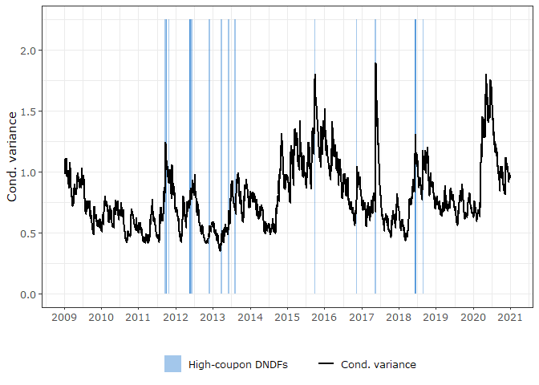<!-- -->

# Windows estimation

## Data preparation

Source `windows_functions.R`:

``` r
source("windows_functions.R")
```

Convert `spr_lead` to `spr` to get the day of each intervention and
create new column with ids for each row:

``` r
d <- garch_spr %>%
  mutate(spr = lag(spr_lead)) %>%
  mutate(id = row_number())
```

Check that “historical” conditional average of ptax is statistically
equal to zero:

``` r
mod_base <- robustbase::lmrob(ptax ~ vix + oil + fx_dees, data = d)
broom::tidy(mod_base)
```

    ## # A tibble: 4 x 5
    ##   term        estimate std.error statistic   p.value
    ##   <chr>          <dbl>     <dbl>     <dbl>     <dbl>
    ## 1 (Intercept)   0.0138    0.0141     0.980 3.27e-  1
    ## 2 vix           0.0801    0.0148     5.40  7.05e-  8
    ## 3 oil          -0.128     0.0244    -5.25  1.66e-  7
    ## 4 fx_dees       0.437     0.0184    23.7   5.88e-113

All days with DNDFs with coupon-libor spread above EMBI+:

``` r
d_spr <- d %>%
  filter(spr == 1) %>%
  mutate(dist = id - lag(id)) %>%
  select(date, id, dist)
```

``` r
# Windows of 1 to 10 days length
days = 1:10
```

Group interventions (exclude adjacent days):

``` r
groups_of_ints <- select(d_spr, c('date', 'id', 'dist')) %>%
  rename(row_n = id) %>%
  mutate(grouped = if_else(dist <= 1, 1, NA_real_)) %>% 
  #filter(is.na(grouped)) # 18 nas
  mutate(grouped = replace(grouped, is.na(grouped), seq(1, 18, 1))) %>%
  mutate(grouped = if_else(grouped == 1, NA_real_, grouped)) %>%
  fill(grouped) %>%
  mutate(grouped = replace_na(grouped, 1))
```

Save first day and last day of the windows:

``` r
groups <- groups_of_ints %>%
  group_by(grouped) %>%
  summarize(first = first(date), last = last(date))
```

    ## `summarise()` ungrouping output (override with `.groups` argument)

Extract first day of each window:

``` r
g_first <- groups %>%
  select(g = grouped, date = first)
```

Extract ids of first day of interventions by groups

``` r
f <- d %>%
  full_join(g_first) %>%
  filter(!is.na(g)) %>%
  select(id, g)
```

    ## Joining, by = "date"

Calculate averages before each window:

``` r
vbw <- map(days, ~days_previous_window(f, .x))
vars_vbw <- map(vbw, ~average_vars(d, .x))
```

    ## Joining, by = "id"

    ## `summarise()` ungrouping output (override with `.groups` argument)

    ## Joining, by = "id"

    ## `summarise()` ungrouping output (override with `.groups` argument)

    ## Joining, by = "id"

    ## `summarise()` ungrouping output (override with `.groups` argument)

    ## Joining, by = "id"

    ## `summarise()` ungrouping output (override with `.groups` argument)

    ## Joining, by = "id"

    ## `summarise()` ungrouping output (override with `.groups` argument)

    ## Joining, by = "id"

    ## `summarise()` ungrouping output (override with `.groups` argument)

    ## Joining, by = "id"

    ## `summarise()` ungrouping output (override with `.groups` argument)

    ## Joining, by = "id"

    ## `summarise()` ungrouping output (override with `.groups` argument)

    ## Joining, by = "id"

    ## `summarise()` ungrouping output (override with `.groups` argument)

    ## Joining, by = "id"

    ## `summarise()` ungrouping output (override with `.groups` argument)

Test that same results are obtained with different method for finding
averages:

``` r
vars_vbw[[5]]
```

    ## # A tibble: 18 x 6
    ##        g  days oil_mean vix_mean dees_mean ptax_mean
    ##    <dbl> <dbl>    <dbl>    <dbl>     <dbl>     <dbl>
    ##  1     1     5 -0.256    0.195      1.12      1.22  
    ##  2     2     5 -0.0584   0.104     -0.196    -0.225 
    ##  3     3     5  0.625   -0.802     -0.722    -0.628 
    ##  4     4     5 -0.166    0.0164     0.556     0.554 
    ##  5     5     5 -0.226   -0.220     -0.193     0.114 
    ##  6     6     5  0.336   -0.193     -0.0297    0.380 
    ##  7     7     5  0.124    0.121     -0.293     0.0928
    ##  8     8     5  0.268   -0.307      0.105     0.282 
    ##  9     9     5 -0.183    0.267      0.458     0.523 
    ## 10    10     5  0.317   -0.190     -0.145     0.0545
    ## 11    11     5 -0.0469  -0.0915     0.0560    0.119 
    ## 12    12     5 -0.145    0.459      0.337     0.402 
    ## 13    13     5 -0.00638 -1.04       0.629     0.532 
    ## 14    14     5  0.260    1.09      -0.654    -0.371 
    ## 15    15     5  0.146   -0.0800     0.254    -0.302 
    ## 16    16     5  0.102   -0.00212    0.612    -1.12  
    ## 17    17     5 -0.0763  -0.0300     0.892     0.166 
    ## 18    18     5  0.190    0          0.364     0.328

``` r
get_mav_tb(d, 5) %>%
  filter(id %in% (f$id - 1)) %>%
  select(date, id, contains('mav'))
```

    ## # A tibble: 18 x 6
    ##    date          id  vix_mav  oil_mav fx_dees_mav ptax_mav
    ##    <date>     <int>    <dbl>    <dbl>       <dbl>    <dbl>
    ##  1 2011-09-21   655  0.195   -0.256        1.12     1.22  
    ##  2 2011-09-30   662  0.104   -0.0584      -0.196   -0.225 
    ##  3 2011-10-27   680 -0.802    0.625       -0.722   -0.628 
    ##  4 2012-05-21   815  0.0164  -0.166        0.556    0.554 
    ##  5 2012-06-06   826 -0.220   -0.226       -0.193    0.114 
    ##  6 2012-11-21   935 -0.193    0.336       -0.0297   0.380 
    ##  7 2012-11-30   941  0.121    0.124       -0.293    0.0928
    ##  8 2013-03-26  1014 -0.307    0.268        0.105    0.282 
    ##  9 2013-05-29  1057  0.267   -0.183        0.458    0.523 
    ## 10 2013-06-07  1063 -0.190    0.317       -0.145    0.0545
    ## 11 2013-08-07  1103 -0.0915  -0.0469       0.0560   0.119 
    ## 12 2015-09-29  1614  0.459   -0.145        0.337    0.402 
    ## 13 2016-11-10  1881 -1.04    -0.00638      0.629    0.532 
    ## 14 2017-05-17  2001  1.09     0.260       -0.654   -0.371 
    ## 15 2018-06-11  2253 -0.0800   0.146        0.254   -0.302 
    ## 16 2018-06-14  2256 -0.00212  0.102        0.612   -1.12  
    ## 17 2018-06-20  2260 -0.0300  -0.0763       0.892    0.166 
    ## 18 2018-08-29  2307  0        0.190        0.364    0.328

Save days from the end of each window:

``` r
g_last <- groups %>%
  select(g = grouped, date = last)
```

Ids of last date of intervention by groups:

``` r
l <- d %>%
  full_join(g_last) %>%
  filter(!is.na(g)) %>%
  select(id, g)
```

    ## Joining, by = "date"

Calculate averages after each window:

``` r
vaw <- map(days, ~days_after_window(l, .x))
vars_vaw <- map(vaw, ~average_vars(d, .x))
```

    ## Joining, by = "id"

    ## `summarise()` ungrouping output (override with `.groups` argument)

    ## Joining, by = "id"

    ## `summarise()` ungrouping output (override with `.groups` argument)

    ## Joining, by = "id"

    ## `summarise()` ungrouping output (override with `.groups` argument)

    ## Joining, by = "id"

    ## `summarise()` ungrouping output (override with `.groups` argument)

    ## Joining, by = "id"

    ## `summarise()` ungrouping output (override with `.groups` argument)

    ## Joining, by = "id"

    ## `summarise()` ungrouping output (override with `.groups` argument)

    ## Joining, by = "id"

    ## `summarise()` ungrouping output (override with `.groups` argument)

    ## Joining, by = "id"

    ## `summarise()` ungrouping output (override with `.groups` argument)

    ## Joining, by = "id"

    ## `summarise()` ungrouping output (override with `.groups` argument)

    ## Joining, by = "id"

    ## `summarise()` ungrouping output (override with `.groups` argument)

Test that same results are obtained with different method for finding
averages:

``` r
vars_vaw[[5]]
```

    ## # A tibble: 18 x 6
    ##        g  days oil_mean vix_mean dees_mean ptax_mean
    ##    <dbl> <dbl>    <dbl>    <dbl>     <dbl>     <dbl>
    ##  1     1     5  0.139    -0.161   -0.379     -0.853 
    ##  2     2     5  0.899    -0.558   -1.12      -1.44  
    ##  3     3     5  0.166     0.505    1.05       0.658 
    ##  4     4     5 -0.591     0.548    1.01      -0.0366
    ##  5     5     5 -0.00424  -0.0146  -0.316      0.0968
    ##  6     6     5  0.124     0.121   -0.293      0.0928
    ##  7     7     5 -0.291    -0.0928   0.0687    -0.325 
    ##  8     8     5 -0.246     0.141    0.00449    0.0174
    ##  9     9     5  0.317    -0.190   -0.145      0.0545
    ## 10    10     5  0.150     0.217   -0.509      0.0326
    ## 11    11     5  0.269     0.375    0.227      0.523 
    ## 12    12     5  0.429    -0.736   -1.13      -0.941 
    ## 13    13     5  0.642    -0.339    0.576     -0.556 
    ## 14    14     5 -0.115    -0.986   -0.599     -0.647 
    ## 15    15     5 -0.0763   -0.0300   0.892      0.166 
    ## 16    16     5  0.426     0.358    0.103     -0.0436
    ## 17    17     5  0.797     0.362    0.0467     0.360 
    ## 18    18     5 -0.0960   -0.119    0.378     -0.248

``` r
get_mav_tb(d, 5) %>%
  filter(id %in% (l$id + 5)) %>%
  select(date, id, contains('mav'))
```

    ## # A tibble: 18 x 6
    ##    date          id vix_mav  oil_mav fx_dees_mav ptax_mav
    ##    <date>     <int>   <dbl>    <dbl>       <dbl>    <dbl>
    ##  1 2011-09-29   661 -0.161   0.139      -0.379    -0.853 
    ##  2 2011-10-11   669 -0.558   0.899      -1.12     -1.44  
    ##  3 2011-11-07   686  0.505   0.166       1.05      0.658 
    ##  4 2012-06-01   823  0.548  -0.591       1.01     -0.0366
    ##  5 2012-06-15   832 -0.0146 -0.00424    -0.316     0.0968
    ##  6 2012-11-30   941  0.121   0.124      -0.293     0.0928
    ##  7 2012-12-10   947 -0.0928 -0.291       0.0687   -0.325 
    ##  8 2013-04-04  1020  0.141  -0.246       0.00449   0.0174
    ##  9 2013-06-07  1063 -0.190   0.317      -0.145     0.0545
    ## 10 2013-06-17  1069  0.217   0.150      -0.509     0.0326
    ## 11 2013-08-15  1109  0.375   0.269       0.227     0.523 
    ## 12 2015-10-07  1620 -0.736   0.429      -1.13     -0.941 
    ## 13 2016-11-21  1887 -0.339   0.642       0.576    -0.556 
    ## 14 2017-05-25  2007 -0.986  -0.115      -0.599    -0.647 
    ## 15 2018-06-20  2260 -0.0300 -0.0763      0.892     0.166 
    ## 16 2018-06-22  2262  0.358   0.426       0.103    -0.0436
    ## 17 2018-06-28  2266  0.362   0.797       0.0467    0.360 
    ## 18 2018-09-11  2313 -0.119  -0.0960      0.378    -0.248

Unlist and tidy the lists with averages and combine them together:

``` r
# Unlist and tidy 'after' tibble
b1 <- bind_rows(vars_vaw) %>%
  pivot_longer(cols = contains('mean'), names_to = 'mean', values_to = 'value') %>%
  mutate(group = 'after') %>%
  select(g, days, mean, value, group)

# Unlist and tidy 'before' tibble
b2 <- bind_rows(vars_vbw) %>%
  pivot_longer(cols = contains('mean'), names_to = 'mean', values_to = 'value') %>%
  mutate(group = 'before') %>%
  select(g, days, mean, value, group)

# Bind together and relevel 'group' column for estimations
b3 <- bind_rows(b1, b2) %>%
  mutate(group = fct_relevel(group, c('after', 'before')))
```

Plot evolution of PTAX before and after each window:

``` r
# To get actual PTAX values, join vbw[[10]] tibble (ids) with 'd', main data file
data_bw10 <- left_join(vbw[[10]], d, by = 'id') %>% 
  mutate(group = 'before') %>%
  group_by(g) %>%
  mutate(time = seq(10, 1, -1))

# Same for after windows but with vaw[[30]]
data_aw10 <- left_join(vaw[[10]], d, by = 'id') %>% 
  mutate(group = 'after') %>% 
  group_by(g) %>%
  mutate(time = seq(1, 10, 1))

data_10 <- bind_rows(data_bw10, data_aw10)

data_10 %>%
  ungroup %>%
  pivot_longer(cols = c('vix', 'oil', 'fx_dees', 'ptax'), values_to = 'value', names_to = 'variable') %>%
  mutate(time = if_else(group == 'after', time, time * -1)) %>%
  mutate(group = fct_relevel(group, c('before', 'after'))) %>%
  filter(variable == 'ptax') %>%
  #mutate(black_line = if_else(days != 0, 0, NA_real_)) %>%
  ggplot(aes(x = time, y = value, group = group)) +
  geom_jitter(aes(y = value, color = group), alpha = .5, width = .1) +
  geom_smooth(se = F, aes(color = group)) +
  scale_color_brewer('', type = 'qual', palette = 'Dark2', direction = -1) +
  #scale_color_viridis_d(begin = 0.25, end = 0.75) +
  scale_x_continuous(breaks = seq(-10, 10, 5)) +
  #geom_line(aes(y = black_line), lwd = 1) +
  #facet_wrap(~variable) +
  theme_bw() +
  theme(legend.position = c(0.9, .15),
        plot.caption = element_text(hjust = 0),
        legend.title = element_blank(),
        legend.spacing.y = unit(0, "mm"), 
        panel.border = element_rect(colour = "black", fill=NA),
        #aspect.ratio = 1, axis.text = element_text(colour = 1, size = 12),
        legend.background = element_blank(),
        legend.box.background = element_rect(colour = "black")) +
  labs(#caption = 'Daily variation of selected variables on x days before/after the window of intervention',
    x = 'Days before/after intervention', y = 'Standard deviation units')
```

    ## `geom_smooth()` using method = 'loess' and formula 'y ~ x'

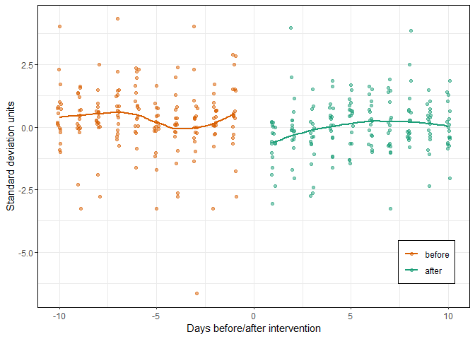<!-- -->

Plot evolution of dependent and independent variables:

``` r
b3 %>%
  mutate(mean = str_remove(mean, '_mean')) %>%
  mutate(mean = case_when(mean == 'ptax' ~ str_to_upper(mean), 
                          mean == 'dees' ~ 'fx.dees',
                          T ~ mean)) %>%
  mutate(mean = fct_relevel(mean, c('PTAX', 'oil', 'vix', 'fx.dees'))) %>% 
  filter(days %in% c(1, 3, 6, 10)) %>%
  mutate(days = if_else(days != 1, str_c(days, ' days'), str_c(days, ' day'))) %>%
  mutate(days = fct_relevel(days, c('1 day', '3 days', '6 days', '10 days'))) %>%
  ggplot(aes(y = mean , x = value)) +
  geom_boxplot(aes(fill = group)) +
  geom_vline(xintercept = 0) +
  scale_fill_brewer('', type = 'qual', palette = 'Dark2') +
  facet_wrap(~ days) +
  guides(fill = guide_legend(reverse = TRUE)) +
  theme_bw(base_family = 'MS Reference Sans Serif') +
  theme(legend.position = 'bottom') +
  labs(y = '',
       x = 'Standard deviation units')
```

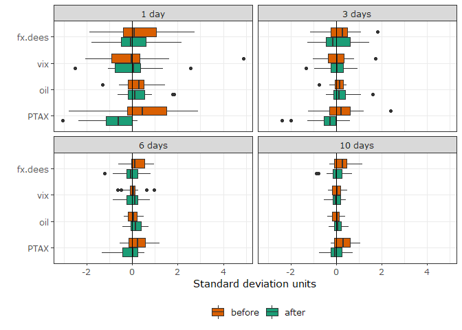<!-- -->

## Estimations

Reshape data for estimations:

``` r
dummy_data <- b3 %>%
  pivot_wider(id_cols = c('g', 'days', 'group'), names_from = 'mean', values_from = 'value') %>%
  mutate(group = fct_relevel(group, c('after', 'before'))) 
```

Estimate the models:

``` r
# Estimate the models
dummy_models <- dummy_data %>%
  nest_by(days) %>%
  mutate(reg = list(lm(ptax_mean ~ group + vix_mean + oil_mean + dees_mean, data = data))) %>%
  mutate(rob = list(robustbase::lmrob(ptax_mean ~ group + vix_mean + oil_mean + dees_mean, data = data, setting = 'KS2014')))
```

# Table A1 and A2:

Extract tables from models and join them together:

``` r
# Top part of the table
top_table <- map2(list(
  map(1:5, function(x) {dummy_models$rob[[x]]}), 
  map(6:10, function(x) {dummy_models$rob[[x]]})
), 
list(
  c(1:5), 
  c(6:10)
),
function(X, Y) {
  as_tibble(texreg::matrixreg(X, 
                              custom.model.names = str_c(Y, ' days'),
                              stars = c(0.01, 0.05, 0.1)))
                  
})


l1 = list(map(1:5, ~dummy_models$rob[[.x]]), map(6:10, ~dummy_models$rob[[.x]]))
l2 = list(c(1:5), c(6:10))

bottom1 <- multi_join(left_join, map2(l1[[1]], l2[[1]], function(X, Y) {
  glance.lmrob(X) %>%
    mutate(name = str_c('V', Y+1)) %>%
    pivot_longer(cols = -name, names_to = 'V1', values_to = 'value') %>%
    pivot_wider(names_from = 'name', values_from = 'value', id_cols = 'V1') %>%
    mutate(across(everything(), ~as.character(.x)))
}))
```

    ## Joining, by = "V1"
    ## Joining, by = "V1"
    ## Joining, by = "V1"
    ## Joining, by = "V1"

``` r
bottom2 <- multi_join(left_join, map2(l1[[2]], l2[[2]], function(X, Y) {
  glance.lmrob(X) %>%
    mutate(name = str_c('V', Y-4)) %>%
    pivot_longer(cols = -name, names_to = 'V1', values_to = 'value') %>%
    pivot_wider(names_from = 'name', values_from = 'value', id_cols = 'V1') %>%
    mutate(across(everything(), ~as.character(.x)))
}))
```

    ## Joining, by = "V1"
    ## Joining, by = "V1"
    ## Joining, by = "V1"
    ## Joining, by = "V1"

``` r
table_a1 <- bind_rows(top_table[[1]], bottom1)
table_a1
```

    ## # A tibble: 14 x 6
    ##    V1          V2            V3           V4           V5           V6          
    ##    <chr>       <chr>         <chr>        <chr>        <chr>        <chr>       
    ##  1 ""          "1 days"      "2 days"     "3 days"     "4 days"     "5 days"    
    ##  2 "(Intercep~ "-0.65 ** "   "-0.35 *  "  "-0.36 ** "  "-0.31 ** "  "-0.14    " 
    ##  3 ""          "(0.25)   "   "(0.20)   "  "(0.16)   "  "(0.13)   "  "(0.10)   " 
    ##  4 "groupbefo~ " 1.17 ***"   " 0.81 ***"  " 0.57 ** "  " 0.38 ** "  " 0.26 *  " 
    ##  5 ""          "(0.33)   "   "(0.25)   "  "(0.22)   "  "(0.17)   "  "(0.13)   " 
    ##  6 "vix_mean"  " 0.13    "   " 0.15    "  " 0.08    "  " 0.27    "  " 0.25    " 
    ##  7 ""          "(0.14)   "   "(0.14)   "  "(0.19)   "  "(0.18)   "  "(0.16)   " 
    ##  8 "oil_mean"  "-0.37    "   "-0.33    "  "-0.19    "  " 0.13    "  "-0.06    " 
    ##  9 ""          "(0.34)   "   "(0.35)   "  "(0.30)   "  "(0.27)   "  "(0.24)   " 
    ## 10 "dees_mean" " 0.33 *  "   " 0.47 ***"  " 0.66 ***"  " 0.63 ***"  " 0.51 ***" 
    ## 11 ""          "(0.18)   "   "(0.16)   "  "(0.17)   "  "(0.16)   "  "(0.14)   " 
    ## 12 "Num. obs." "36       "   "36       "  "36       "  "36       "  "36       " 
    ## 13 "r.squared" "0.496662826~ "0.52677664~ "0.55034891~ "0.53681075~ "0.53208113~
    ## 14 "adj.r.squ~ "0.431716094~ "0.46571556~ "0.49232942~ "0.47704440~ "0.47170450~

``` r
table_a2 <- bind_rows(top_table[[2]], bottom2)
table_a2
```

    ## # A tibble: 14 x 6
    ##    V1          V2            V3           V4           V5           V6          
    ##    <chr>       <chr>         <chr>        <chr>        <chr>        <chr>       
    ##  1 ""          "6 days"      "7 days"     "8 days"     "9 days"     "10 days"   
    ##  2 "(Intercep~ "-0.08    "   "-0.08    "  "-0.02    "  "-0.01    "  " 0.00    " 
    ##  3 ""          "(0.10)   "   "(0.09)   "  "(0.07)   "  "(0.07)   "  "(0.07)   " 
    ##  4 "groupbefo~ " 0.19    "   " 0.20    "  " 0.18    "  " 0.19 *  "  " 0.17 *  " 
    ##  5 ""          "(0.14)   "   "(0.13)   "  "(0.11)   "  "(0.11)   "  "(0.10)   " 
    ##  6 "vix_mean"  " 0.13    "   " 0.11    "  " 0.24    "  " 0.32    "  " 0.21    " 
    ##  7 ""          "(0.18)   "   "(0.20)   "  "(0.19)   "  "(0.24)   "  "(0.23)   " 
    ##  8 "oil_mean"  " 0.02    "   " 0.14    "  " 0.10    "  "-0.04    "  " 0.11    " 
    ##  9 ""          "(0.27)   "   "(0.24)   "  "(0.21)   "  "(0.21)   "  "(0.21)   " 
    ## 10 "dees_mean" " 0.65 ***"   " 0.73 ***"  " 0.64 ***"  " 0.60 ***"  " 0.64 ***" 
    ## 11 ""          "(0.17)   "   "(0.16)   "  "(0.15)   "  "(0.17)   "  "(0.15)   " 
    ## 12 "Num. obs." "36       "   "36       "  "36       "  "36       "  "36       " 
    ## 13 "r.squared" "0.512588388~ "0.62237211~ "0.61361797~ "0.58511002~ "0.63402094~
    ## 14 "adj.r.squ~ "0.449696568~ "0.57364594~ "0.56376222~ "0.53157583~ "0.58679783~

Create tibbles with confidence intervals and bind them together:

``` r
tidied90 <- dummy_models %>%
  mutate(tidied = list(tidy(rob, conf.int = T, conf.level = .9))) %>%
  unnest(tidied) %>%
  filter(term %in% c('(Intercept)', 'groupbefore')) %>%
  mutate(term = case_when(term == 'groupbefore' ~ 'Before',
                          T ~ 'Intercept')) %>%
  select(days, term, cl90 = conf.low, ch90 = conf.high) %>%
  ungroup()

tidied95 <- dummy_models %>%
  mutate(tidied = list(tidy(rob, conf.int = T, conf.level = .95))) %>%
  unnest(tidied) %>%
  filter(term %in% c('(Intercept)', 'groupbefore')) %>%
  mutate(term = case_when(term == 'groupbefore' ~ 'Before',
                          T ~ 'Intercept')) %>%
  select(term, cl95 = conf.low, ch95 = conf.high) %>%
  ungroup() %>%
  select(-days)
```

    ## Adding missing grouping variables: `days`

``` r
tidied99 <- dummy_models %>%
  mutate(tidied = list(tidy(rob, conf.int = T, conf.level = .99))) %>%
  unnest(tidied) %>%
  filter(term %in% c('(Intercept)', 'groupbefore')) %>%
  mutate(term = case_when(term == 'groupbefore' ~ 'Before',
                          T ~ 'Intercept')) %>%
  select(term, cl99 = conf.low, ch99 = conf.high) %>%
  ungroup() %>%
  select(-days)
```

    ## Adding missing grouping variables: `days`

``` r
tidied_cfint <- bind_cols(tidied90, tidied95, tidied99) %>%
  select(-5, -8) %>%
  rename(term = term...2)
```

    ## New names:
    ## * term -> term...2
    ## * term -> term...5
    ## * term -> term...8

# Figure 6

Plot:

``` r
panel_a <- tidied_cfint %>%
  pivot_longer(cols = -c(days, term), names_to = 'conf', values_to = 'value') %>%
  mutate(level = case_when(str_detect(conf, '90') ~ '(90%)',
                           str_detect(conf, '95') ~ '(95%)',
                           T ~ '(99%)')) %>%
  mutate(border = if_else(str_detect(conf, 'h'), 'sup', 'inf')) %>%
  select(-conf) %>%
  pivot_wider(names_from = border, values_from = value) %>%
  mutate(level = fct_rev(level)) %>%
  #mutate(days = fct_rev(as_factor(days))) %>%
  mutate(days = if_else(term == 'Before', days * -1, days)) %>%
  filter(term == 'Before') %>%
  ggplot(aes(x = days)) +
  geom_ribbon(aes(ymin = inf, ymax = sup, fill = level), alpha = .5) +
  geom_hline(yintercept = 0) +
  scale_fill_manual('Significance level', values = c('darkred', 'darkorange', 'yellow')) +
  facet_wrap(~ term, scales = 'free_x') +
  labs(x = 'Model (days)', y = 'Confidence intervals',
       subtitle = 'A. Main Regressors') +
  theme_bw() +
  theme(legend.position = 'none') +
  scale_x_continuous(breaks = seq(-10, 0, 2), labels = seq(-10, 0, 2), minor_breaks = seq(-10, 0, 1)) +
  scale_y_continuous(breaks = seq(-2, 2, 1), limits = c(-1.5, 2.2))

panel_b <- tidied_cfint %>%
  pivot_longer(cols = -c(days, term), names_to = 'conf', values_to = 'value') %>%
  mutate(level = case_when(str_detect(conf, '90') ~ '(90%)',
                           str_detect(conf, '95') ~ '(95%)',
                           T ~ '(99%)')) %>%
  mutate(border = if_else(str_detect(conf, 'h'), 'sup', 'inf')) %>%
  select(-conf) %>%
  pivot_wider(names_from = border, values_from = value) %>%
  mutate(level = fct_rev(level)) %>%
  filter(term == 'Intercept') %>%
  ggplot(aes(x = days)) +
  geom_ribbon(aes(ymin = inf, ymax = sup, fill = level), alpha = .5) +
  geom_hline(yintercept = 0) +
  scale_fill_manual('Significance level', values = c('darkred', 'darkorange', 'yellow')) +
  facet_wrap(~ term, scales = 'free_x') +
  labs(x = 'Model (days)', y = '', subtitle = '') +
  theme_bw() +
  theme(legend.position = c(.65, .745)) +
  scale_x_continuous(breaks = seq(0, 10, 2), minor_breaks = seq(0, 10, 1)) +
  scale_y_continuous(breaks = seq(-2, 2, 1), limits = c(-1.5, 2.2))

panel_ab <- ggpubr::ggarrange(panel_a, panel_b, ncol = 2, common.legend = T)

windows_rsquared_plot <- dummy_models %>%
  mutate(tidied = list(glance.lmrob(rob))) %>%
  unnest(tidied) %>%
  pivot_longer(cols = c('r.squared', 'adj.r.squared'), names_to = 'stat', values_to = 'value') %>%
  mutate(stat = fct_relevel(stat, c('r.squared', 'adj.r.squared'))) %>%
  ggplot(aes(x = days)) +
  geom_line(aes(y = value, color = stat)) +
  scale_x_continuous(breaks = seq(0, 10, 3), minor_breaks = NULL) +
  scale_color_brewer(palette = 'Dark2') +
  labs(y = 'R squared', x = 'Model (days)',
       subtitle = 'B. Goodness of fit statistics') +
  theme_bw() +
  theme(legend.title = element_blank(),
        legend.position = c(0.75, 0.3),
        legend.background = element_blank())

fig6 <- ggpubr::ggarrange(panel_ab, windows_rsquared_plot, nrow = 2, heights = c(1.3, .8), common.legend = F)

ggsave("Figures/fig6.png", plot = fig6, dpi = 500, height = 4, width = 6.5)

fig6
```

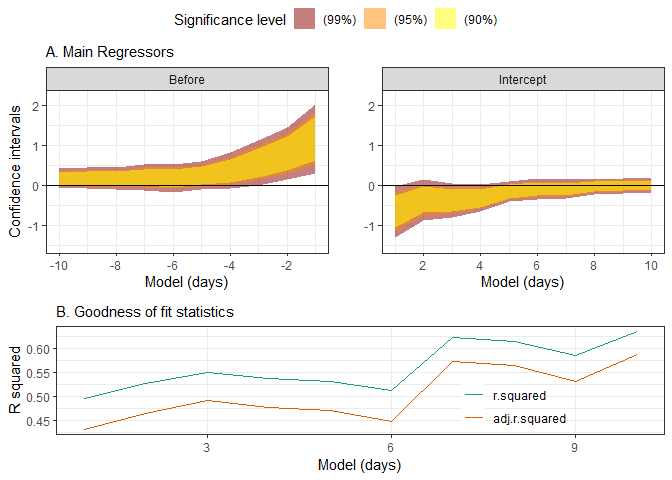<!-- -->

# Figure 7

``` r
fig7 <- filter(bis_fx_plot, name != "BR") %>%
  ggplot(aes(x = date, y = value)) +
  scale_color_manual("", values = "tomato3", labels = "BRL") +
  geom_line(alpha = 0.5, aes(group = name), color = "salmon2") +
  geom_line(data = filter(bis_fx_plot, name == "BR"), aes(color = name), size = 1.5) +
  scale_x_date(date_breaks = "2 years", date_labels = "%Y") +
  theme_bw() +
  scale_y_log10() +
  theme(legend.position = c(0.1, 0.85)) +
  labs(x = "", y = '')

ggsave("Figures/fig7.png", plot = fig7, dpi = 500, height = 4, width = 6.5)

fig7
```

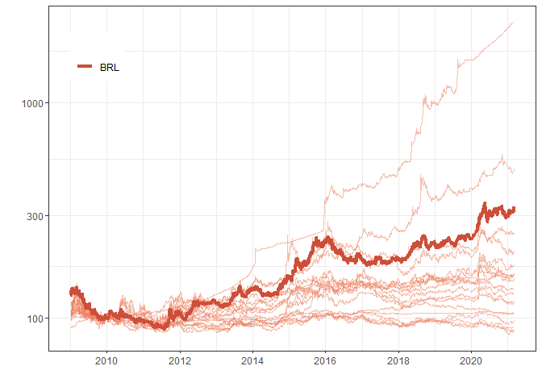<!-- -->
